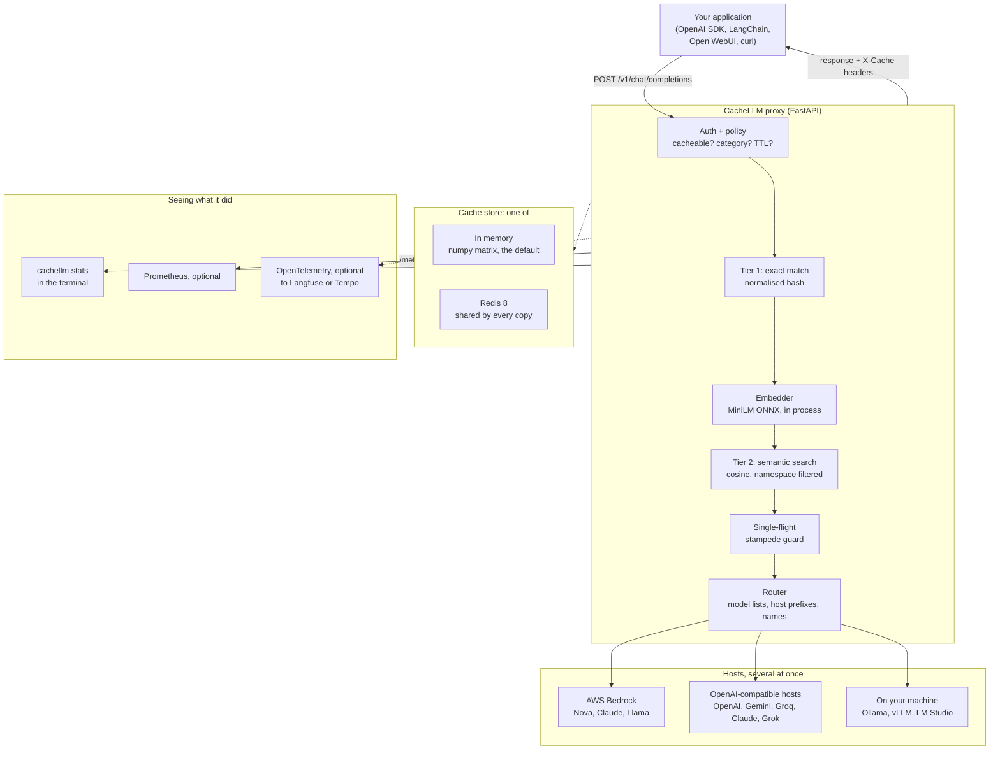
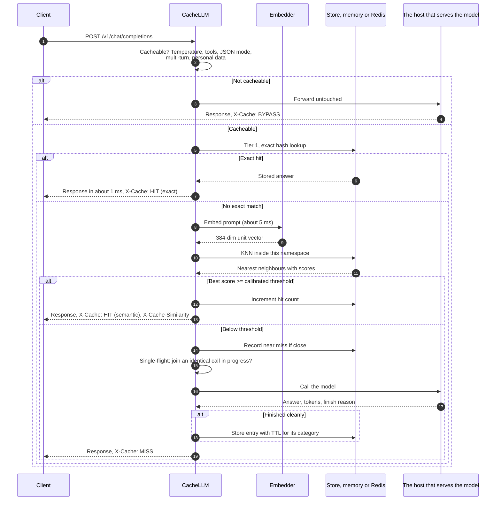
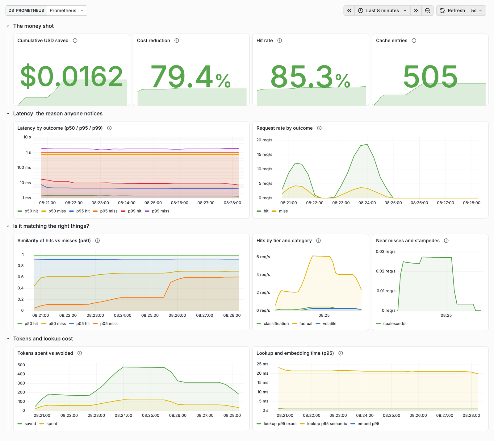

# CacheLLM

[](https://github.com/adarshcod30/CacheLLM/actions/workflows/ci.yml)
[](https://www.python.org/)
[](LICENSE)
[](tests/)
[](https://pypi.org/project/cachellm-proxy/)
[](docs/evaluation.md)

**A drop-in semantic cache for OpenAI-compatible LLM APIs. Change one base URL, and questions your model has already answered come back in milliseconds instead of seconds.**

On a 2,000-request replay against **AWS Bedrock** it served **77% of traffic from cache** with **zero false positives** on genuinely new questions, cutting spend by **78%** and p95 latency from 1,023 ms to **5.7 ms** on a cache hit, or 9.7 ms when the question was reworded.

[Quick start](#quick-start) · [How it works](#how-it-works) · [Evaluation](docs/evaluation.md) · [API reference](#api-reference) · [Deployment](#deployment-and-infrastructure)


*Real requests against Amazon Nova Micro on AWS Bedrock. A new question takes 1.6 seconds. The same question repeated takes 2.5 ms. A reworded version takes 2.9 ms at 0.99 similarity. A genuinely different question still misses, and anything with personal data in it is never stored.*

`llm` `semantic-cache` `openai-compatible` `fastapi` `redis` `vector-search` `aws-bedrock` `llmops` `prometheus` `grafana` `opentelemetry` `cost-optimization`

> **Status.** Working software with a real test suite and reproducible numbers. It runs locally or in Docker. There is no hosted demo URL: this is infrastructure you run in front of your own LLM calls, so the [quick start](#quick-start) has it serving traffic in about two minutes.

---

## The problem

Every team running LLMs at scale pays twice for the same answer. Users ask the same questions in different words, support bots field the same twenty issues all day, and batch jobs re-classify near-identical rows. Each of those is a fresh API call: real money, and one to three seconds a user waits.

A normal cache does not help. Change one letter and the key misses, so exact-match caching catches almost nothing in natural language.

CacheLLM caches by **meaning**. It embeds each prompt, searches for the nearest answer it has already paid for, and serves it when the match is close enough. Your application changes one line:

```python
client = OpenAI(base_url="http://localhost:8080/v1")  # was https://api.openai.com/v1
```

Everything else stays the same: same request shape, same response shape, same errors, same streaming. Responses carry `X-Cache` headers so you can see exactly what happened.

## Headline results

2,000 requests at concurrency 8 against **Amazon Nova Micro on AWS Bedrock**, from a laptop in India. Full method, caveats and reproduction steps in [docs/evaluation.md](docs/evaluation.md).

| Metric | Result |
| --- | ---: |
| Hit rate | **77.0%** (ceiling for this workload: 79.6%) |
| False positives on genuinely new questions | **0 of 368** |
| Reworded repeats served from cache | 95.2% |
| Exact repeats served from cache | 99.3% |
| p95 latency, any cache hit | **5.7 ms** |
| p95 latency, reworded hit | 9.7 ms |
| p95 latency, cache miss | 1,022.8 ms |
| p95 speedup | **178.8x** |
| Cost reduction | **78.0%** |
| Throughput | 41.9 req/s |
| Errors | 0 |

Hit rate climbed from 44% in the first hundred requests to 87% in the last hundred as the cache warmed. The whole run cost **$0.0038** in real Bedrock charges, because 1,540 of the 2,000 requests never reached the model.

The same benchmark runs without any cloud credentials against the built-in fake provider, and lands within half a point: 77.2% hit rate, again with zero false positives. That version is what CI asserts on every push.

## Key features

| Feature | What it does | Why it exists |
| --- | --- | --- |
| **Drop-in OpenAI API** | Same request and response shape, streaming included, verified against the official `openai` Python SDK in CI | Adoption has to cost one line, or nobody adopts it |
| **Several providers at once** | One proxy routes each model to the host that serves it, using each host's live model list: Gemini, Groq, OpenAI, Claude, Grok, Ollama and more, found from the keys you already have | Real apps mix models from different vendors, and one cache in front of all of them should not need one proxy per vendor |
| **Runs with nothing installed** | Defaults to an in-process numpy store; uses Redis automatically when it can reach one | A cache you have to provision a server for does not get tried. Redis takes over when you actually need shared, durable state |
| **Two-tier cache** | Exact-match tier answers literal repeats in about a millisecond without embedding; semantic tier handles rewording | 82% of hits came from the exact tier: free, fast and impossible to get semantically wrong |
| **Per-model threshold calibration** | Ships measured safe thresholds for six embedding models and picks the right one automatically | Measured safe thresholds span 0.89 to 0.98. A threshold copied between models is a guess |
| **Cacheability policy** | Classifies every prompt and decides cacheable, category, TTL | Creative writing, live data and personal questions must not be cached like a fact |
| **Personal-data guard** | Refuses to store prompts containing emails, long digit runs, API keys or "my order" phrasing | Serving one user's answer to another is the failure that gets a cache torn out |
| **Shadow mode** | Logs what the cache would have served, then calls the provider anyway | Lets a team watch it on real traffic for a week before trusting it |
| **Namespace isolation** | System prompt, model, host, temperature and max tokens all fold into the cache key | Two features sharing a proxy must never share answers |
| **Targeted invalidation** | Drop a namespace or a model with one call, backed by an index lookup rather than a keyspace scan | "The system prompt changed" and "we upgraded the model" are routine events |
| **Stampede protection** | Identical concurrent misses collapse into a single upstream call | Ten users asking one new question should cost one generation, not ten |
| **Streaming both ways** | Misses stream through while buffering; hits replay as a stream | A cached answer must not break a client that asked for a stream |
| **Fails open** | If Redis or the embedder dies, it forwards everything upstream and reports itself degraded | A cache that takes your app down is worse than no cache |
| **Near-miss analysis** | Records every lookup that landed just below the threshold, with a cumulative histogram | Tune the threshold on your own traffic instead of guessing |
| **Threshold sweep endpoint** | Score your own labelled pairs and see the precision and recall tradeoff | The tuning question, answered with your data |
| **Full observability** | Prometheus metrics, a provisioned Grafana dashboard, structured logs, optional OpenTelemetry to Langfuse | Nobody leaves a cache on that they cannot see |

## Tech stack

| Layer | Choice | Why this one |
| --- | --- | --- |
| Language | Python 3.11+ | Where the LLM ecosystem lives |
| Packaging | `uv` | Fast resolution, a real lockfile, reproducible in CI |
| API | FastAPI + Uvicorn | Async, native streaming, OpenAPI docs for free |
| Validation and config | Pydantic v2, pydantic-settings | Typed request shapes and typed configuration from the environment |
| Embeddings | fastembed, `all-MiniLM-L6-v2` (ONNX, CPU) | In-process and about 6 ms. A hosted embedding API would put 100 ms in front of every cache hit and defeat the point |
| Vector store, default | numpy matrix in the proxy's own memory | Nothing to install. Scanning 20,000 cached prompts takes 0.85 ms, where a Redis round trip alone costs 2 to 3 ms, so below roughly 100k entries this is not a compromise, it is faster |
| Vector store, at scale | Redis 8 + RedisVL, HNSW over cosine | One process is the exact-match store, the vector index and the stampede lock. Shared across workers, survives restarts, and an approximate index starts paying above ~100k entries |
| Providers | AWS Bedrock (Converse), any OpenAI-compatible endpoint, deterministic fake | Converse reaches Nova, Claude, Llama and Mistral with one request shape and no extra vendor keys |
| Metrics | prometheus-client, Prometheus, Grafana | Dashboard ships provisioned, so a reviewer sees data on first boot |
| Tracing | OpenTelemetry, optional, GenAI semantic conventions | Instrument once, export to Langfuse, Tempo or Jaeger |
| Logging | structlog, JSON, prompts redacted by default | A proxy sees every question every user asks |
| Testing | pytest, 126 tests, real Redis in CI | Including the official OpenAI SDK driving the proxy |
| Quality | ruff, mypy strict-ish, GitHub Actions across Python 3.11, 3.12, 3.13 | |
| Containers | Docker multi-stage, Docker Compose | Model baked into the image so a cold container does not download 90 MB on its first request |

## How it works

### System architecture



**In plain language.** Your app talks to CacheLLM exactly as it would talk to OpenAI. The proxy first decides whether this request may be cached at all. If it may, it tries a cheap exact-match lookup. Failing that, it embeds the prompt locally and asks its store, memory by default or Redis, for the nearest answer it has already paid for, but only among answers allowed to serve this system prompt, model and host. If nothing is close enough, it forwards to whichever host serves that model, streams the answer back, and stores it for next time. Every request lands in a log that `cachellm stats` reads, so hit rate and money saved are visible live.

### Request flow



### Why two tiers

The exact tier costs one Redis `GET` and no embedding. Against Bedrock it produced 1,265 of 1,540 hits: 82% of all cache hits, at about 2.6 ms each, with no possibility of a semantic mistake. The semantic tier added another 275 hits, close to 14 points of hit rate, and it is the tier that carries risk. Building the cheap safe tier first is the difference between a demo and something you would deploy.

### What is deliberately not cached

Prompts above 0.3 temperature, requests for multiple completions, tool calls, JSON mode, multi-turn conversations, non-text content, prompts over 8,000 characters, and anything that looks like personal data. Each rule maps to a specific way a naive cache goes wrong, each is a flag you can flip, and each shows up in the response as `X-Cache-Bypass-Reason`.

## The evaluation pipeline

This is where a caching project usually hand-waves. The full write-up is in [docs/evaluation.md](docs/evaluation.md); here is the shape of it.

**Data.** A hand-built labelled corpus in `eval/corpus.py`: 40 question groups covering 120 prompts, plus 35 **hard negatives**. Hard negatives are pairs one word apart with opposite meaning, like "undo the last git commit" against "undo the last git merge". That gives 193 labelled pairs, 123 duplicates and 70 non-duplicates. Any cache scores well on paraphrases alone, so hard negatives are the actual test.

**Method.** Embed both sides of every pair, sweep the cosine threshold from 0.70 to 1.00, and report recall, precision, F1 and how many hard negatives got served at each step. Then repeat across six embedding models and score each on the metric that matters: *the most recall you can get while serving zero hard negatives*.

**Result 1: one threshold cannot do the job.** With `bge-small`, the model most tutorials reach for, the first threshold that serves zero hard negatives is 0.96, and it catches 8.1% of genuine duplicates. Meanwhile "What is CORS?" and "Explain cross origin resource sharing" score 0.55, while "git commit" against "git merge" scores 0.95. The distributions overlap.

**Result 2: thresholds do not transfer between models.** The safe threshold ranges from 0.89 for MiniLM to 0.98 for Arctic-embed. Every model tested had negative separation, meaning the mean duplicate score sat below the worst hard negative. Bigger and slower did not fix it.

| Model | Safe threshold | Recall there | Embed ms p50 |
| --- | ---: | ---: | ---: |
| `all-MiniLM-L6-v2` | **0.89** | **35.0%** | 5.5 |
| `gte-base` | 0.96 | 26.0% | 20.7 |
| `jina-embeddings-v2-small-en` | 0.96 | 16.3% | 1.7 |
| `bge-base-en-v1.5` | 0.94 | 11.4% | 7.5 |
| `snowflake-arctic-embed-s` | 0.98 | 11.4% | 2.7 |
| `bge-small-en-v1.5` | 0.96 | 8.1% | 3.0 |

MiniLM gives four times the safe recall of bge-small, for a slightly larger download of 86 MB against 63 MB, so it is the default. Embed times are the median for one real question on an Apple M4, with the cache off. The whole table ships in code as `CALIBRATED_THRESHOLDS`, and the proxy warns at startup if you configure a model it has never measured.

**Result 3, a negative one: a lexical guard does not rescue it.** The obvious fix is to require matched prompts to share content words. Measured, hard negatives have *higher* token overlap (0.42 mean) than genuine paraphrases share vocabulary, because they differ by exactly one decisive word. The guard rejects good matches and keeps dangerous ones. It was measured and dropped rather than shipped.

**Result 4: the benchmark was flattering itself.** The first load test reported 79.1% and also showed 37 supposedly-new questions hitting the cache. They were not new: the long-tail generator emitted five phrasings per topic, so the "unseen" pool was full of paraphrases of itself. Fixed to one phrasing per topic, cross-matching fell to zero and the headline dropped to 77.2%. The lower number is the honest one.

## Quick start

Python 3.11 or newer, and nothing else.

```bash
pip install cachellm-proxy
cachellm serve
```

That is the whole install. No Redis, no Docker, no config file. On startup it looks for a provider you already have: an API key in your environment, Ollama running locally, or AWS credentials. It logs which one it picked and how to override it.

To see what it found before starting anything:

```bash
cachellm providers
```

To try it with no account at all, the built-in test double stands in for a model:

```bash
CACHELLM_DEFAULT_PROVIDER=fake CACHELLM_FAKE_LATENCY_MS=600 cachellm serve
```

You only install what you actually route to. The base package is the proxy plus the local embedding model; AWS and Redis are extras, and nothing here installs Grafana or a Prometheus server, which are separate programs rather than Python packages.

| You want | Install |
| --- | --- |
| Any OpenAI-compatible endpoint: OpenAI, Groq, Gemini, Ollama, vLLM | `pip install cachellm-proxy` |
| AWS Bedrock | `pip install "cachellm-proxy[aws]"` |
| Redis instead of the in-process cache | `pip install "cachellm-proxy[redis]"` |
| Tracing to Langfuse or Tempo | `pip install "cachellm-proxy[observability]"` |
| Everything | `pip install "cachellm-proxy[all]"` |

Ask for a provider or backend whose extra is missing and the proxy names the exact command to fix it rather than raising an import error.

The distribution is `cachellm-proxy` because PyPI blocks `cachellm` as too close to an existing `cachelm`. The import name and the CLI are both still `cachellm`.

From source, if you plan to change anything:

```bash
git clone https://github.com/adarshcod30/CacheLLM.git
cd CacheLLM
uv sync && uv run cachellm serve
```

In another terminal, ask the same thing twice and watch the second one come back instantly:

```bash
curl -s -D- http://localhost:8080/v1/chat/completions -H 'Content-Type: application/json' -d '{"model":"fake/echo","temperature":0,"messages":[{"role":"user","content":"What is Redis used for?"}]}' | grep -i '^x-cache'
```

Run it again, then try a reworded version, and compare the headers:

```bash
curl -s -D- http://localhost:8080/v1/chat/completions -H 'Content-Type: application/json' -d '{"model":"fake/echo","temperature":0,"messages":[{"role":"user","content":"explain what redis does"}]}' | grep -i '^x-cache'
```

You should see `X-Cache: MISS`, then `HIT` on the exact repeat with `X-Cache-Tier: exact`, then `HIT` on the reworded one with `X-Cache-Tier: semantic` and a similarity score.

Point a real client at it:

```python
from openai import OpenAI

client = OpenAI(base_url="http://localhost:8080/v1", api_key="unused")
response = client.chat.completions.create(
    model="fake/echo",
    temperature=0,
    messages=[{"role": "user", "content": "What is Redis used for?"}],
)
print(response.choices[0].message.content)
```

Run the whole stack, including Prometheus and a pre-provisioned Grafana dashboard:

```bash
make up
```

Then open Grafana at `http://localhost:3000` and the API docs at `http://localhost:8080/docs`.

Reproduce the numbers in this README:

```bash
make tune && make compare-models && make bench
```

### Using a real provider

Export the key your provider gave you, under its usual name, and start the proxy. It reads every key it recognises at startup, so you can use several providers at once, and everything except Bedrock speaks the OpenAI protocol, so no extra is needed.

| Host | Key it reads | Example model |
| --- | --- | --- |
| OpenAI | `OPENAI_API_KEY` | `gpt-5.6-luna` |
| Google Gemini | `GEMINI_API_KEY` or `GOOGLE_API_KEY` | `gemini-2.5-flash` |
| Groq | `GROQ_API_KEY` | `openai/gpt-oss-20b` |
| Anthropic | `ANTHROPIC_API_KEY` | `claude-haiku-4-5` |
| xAI | `XAI_API_KEY` | `grok-4.6` |
| OpenRouter | `OPENROUTER_API_KEY` | `anthropic/claude-3.5-sonnet` |
| Together | `TOGETHER_API_KEY` | `meta-llama/Llama-3.3-70B-Instruct-Turbo` |
| Ollama, on your machine | none, found when it is running | `qwen2.5:0.5b` |

`cachellm providers` lists all seventeen, with each one's base URL.

```bash
export GROQ_API_KEY=gsk_your_key
cachellm serve
```

For a server of your own, such as vLLM, LM Studio or a company gateway, set the endpoint yourself. Then every request goes there, whatever other keys are exported:

```bash
CACHELLM_OPENAI_BASE_URL=http://localhost:8000/v1 cachellm serve
```

**AWS Bedrock** is the one exception, because it does not speak the OpenAI protocol. It needs the `aws` extra, and then uses your existing AWS credentials with no vendor API key at all:

```bash
pip install "cachellm-proxy[aws]"
CACHELLM_DEFAULT_PROVIDER=bedrock AWS_REGION=us-east-1 cachellm serve
```

```bash
curl -s http://localhost:8080/v1/chat/completions -H 'Content-Type: application/json' -d '{"model":"bedrock/us.amazon.nova-micro-v1:0","temperature":0,"messages":[{"role":"user","content":"What is Redis used for?"}]}'
```

If your credentials come from `aws login` rather than static keys or an SSO profile, that provider needs the CRT extra, which the `aws` extra already includes. The proxy detects that case and says so in the error rather than passing along boto's version of the message.

### Several providers at once

With keys for more than one host, one proxy serves all of them, and each request goes to the host that serves its model. This table is from a live run with `GEMINI_API_KEY` and `GROQ_API_KEY` exported and Ollama running, all through a single proxy:

| Your app sends | Answered by | Because |
| --- | --- | --- |
| `gemini-2.5-flash` | Google Gemini | Gemini lists it |
| `models/gemini-3.5-flash-lite` | Google Gemini | Gemini lists it |
| `openai/gpt-oss-20b` | Groq | Groq lists it |
| `groq/openai/gpt-oss-120b` | Groq, as `openai/gpt-oss-120b` | an explicit host prefix |
| `qwen2.5:0.5b` | Ollama | Ollama lists it |
| `mistral/mistral-large-latest` | nobody, with an error naming `MISTRAL_API_KEY` | no key for that host |

Six rules decide, in order, and you never write a model list:

1. **`bedrock/` and `fake/`** pick the adapters this proxy owns.
2. **Bedrock's `vendor.model` ids**, like `amazon.nova-lite-v1:0`, go to Bedrock.
3. **A host's own model list.** At startup the proxy asks every host for its `/models`, so a name goes to the host that actually serves it. This is what sends `openai/gpt-oss-20b` to Groq. Lists refresh in the background when an unknown name turns up and they are over ten minutes old.
4. **A host prefix**, LiteLLM style: `groq/openai/gpt-oss-120b` sends `openai/gpt-oss-120b` to Groq.
5. **Naming conventions**: `claude-` for Anthropic, `gemini-` for Gemini, `grok-` for xAI, plus DeepSeek, Mistral, Perplexity and Moonshot names, when you have that host's key.
6. **Everything else** goes to the default host, which is the first one found.

Choose the hosts, and the default, with `CACHELLM_HOSTS`. The first one named is the default:

```bash
CACHELLM_HOSTS=groq,gemini cachellm serve
```

Check where any name would go while the proxy runs:

```bash
cachellm route openai/gpt-oss-20b
```

Answers are cached per host, so one host's answer is never served for another, and every response says who answered in its `X-Cache-Upstream` header. Models on your own machine, like Ollama's, count as free: a hit there saves time, not money. Note that `anthropic.claude-…` with a dot is a Bedrock id while `anthropic/claude-…` with a slash is an OpenRouter id, and the router tells them apart.

**Checked live, not just in tests.** On 2026-09-11 the proxy ran against real **Google Gemini**, **Groq** and **Ollama** one host at a time, and then all three through one proxy, driven by the official OpenAI SDK, alongside the AWS Bedrock benchmark. Each single-host run covers a miss, an exact hit, a reworded hit, a similar question that must not hit, a stream and its replay, a hot-temperature bypass and an unknown model's error, and checks that the API key never reaches the log. Results are in [docs/evaluation.md](docs/evaluation.md#live-provider-checks), and `bench/live_check.py` and `bench/live_routing.py` rerun them with your own keys. The other hosts share the same adapter and its tests, but have not yet been run against the real service.

### Where the cache lives

One setting, `CACHELLM_BACKEND`, with three values. Most people never touch it.

| Value | What happens | Choose it when |
| --- | --- | --- |
| `auto`, the default | Redis if the extra is installed and a usable server answers, the in-process cache otherwise | You have no opinion |
| `memory` | A numpy matrix inside the proxy. Nothing to install | One process: a laptop, a side project, a single server |
| `redis` | One Redis server shared by every copy of the proxy | Several processes must share one cache |

Memory is not the slow option. Below roughly 100,000 entries it is the faster one: scanning 20,000 cached prompts takes 0.85 ms, while a Redis round trip alone costs 2 to 3 ms. Redis earns its place when several processes need one shared cache. Run four copies of the proxy on memory and you have four separate caches, each a quarter as warm.

Memory can survive a restart too. Give it a file, and it saves there on a clean shutdown and loads it back on start:

```bash
CACHELLM_MEMORY_SNAPSHOT_PATH=$HOME/.cachellm/cache.npz cachellm serve
```

**Setting up Redis.** Install the extra, then run a Redis 8 server:

```bash
pip install "cachellm-proxy[redis]"
brew install redis && brew services start redis    # macOS
docker run -d -p 6379:6379 redis:8-alpine          # anywhere with Docker
```

The server has two requirements, and both are checked at startup:

- **It needs the search module**, which is what stores and searches vectors. Redis 8 from Homebrew or the official Docker image includes it. Many Linux distribution packages ship an older Redis without it, so prefer the Docker image there. A hosted Redis works if its plan includes search.
- **It has to be database 0**, because Redis search cannot index any other. Keep several apps apart with `CACHELLM_INDEX_NAME` instead.

If either is missing, `auto` uses memory and says exactly why, both in a startup warning and at the top of `cachellm stats`. With `CACHELLM_BACKEND=redis` the proxy never switches storage behind your back. It keeps answering without a cache and reports itself degraded until Redis is fixed.

## API reference

### Chat completions

`POST /v1/chat/completions` accepts the OpenAI chat completions body unchanged, streaming included. Unknown fields pass through rather than erroring, because OpenAI adds parameters regularly and a proxy that rejects them is not a drop-in.

Every response carries headers explaining the decision:

| Header | Meaning |
| --- | --- |
| `X-Cache` | `HIT`, `MISS`, `BYPASS` or `SHADOW` |
| `X-Cache-Tier` | `exact` or `semantic` |
| `X-Cache-Similarity` | Cosine similarity of the match |
| `X-Cache-Threshold` | Threshold in force for this category |
| `X-Cache-Category` | `factual`, `classification`, `creative`, `volatile`, `conversational` |
| `X-Cache-Bypass-Reason` | Why it was not cached, when it was not |
| `X-Cache-Saved-USD` | Modelled money this hit avoided |
| `X-Cache-Age-Seconds` | How old the served entry is |
| `X-Cache-Lookup-Ms`, `X-Cache-Latency-Ms` | Lookup time and total time |
| `X-Cache-Coalesced` | Present when this request joined an in-flight identical call |
| `X-Cache-Upstream` | Which host answered, or whose cached answer this is |

Clients can steer per request with `X-Cache-Control`:

| Value | Effect |
| --- | --- |
| `no-store` or `no-cache` | Skip the cache entirely for this request |
| `only-if-cached` | Return 504 rather than calling the provider on a miss |

### Operator endpoints

| Endpoint | Purpose |
| --- | --- |
| `GET /admin/stats` | Hit rate, tier split, money saved, latency percentiles, entry count |
| `GET /admin/config` | Effective thresholds, TTLs and rules |
| `GET /admin/providers` | The hosts this proxy routes to and how many models each lists, plus every supported host |
| `GET /admin/route/{model}` | Which host one model name goes to, what it receives, and why |
| `POST /admin/invalidate` | Drop by `namespace`, by `model`, or `all` |
| `GET /admin/requests` | Recent request log: what the cache did with each one |
| `GET /admin/near-misses` | Recent lookups that landed just below threshold |
| `GET /admin/near-miss-histogram` | Cumulative view of what a lower threshold would buy |
| `GET /admin/entries` | Inspect what is stored |
| `POST /admin/threshold-sweep` | Score your own labelled pairs across thresholds |
| `POST /admin/reset-stats` | Clear counters |
| `GET /metrics` | Prometheus exposition |
| `GET /healthz`, `GET /readyz` | Liveness, and readiness that reports degraded rather than failing |

Tune the threshold against your own traffic:

```bash
curl -s http://localhost:8080/admin/threshold-sweep -H 'Content-Type: application/json' -d '{"pairs":[{"a":"how do I reset my password","b":"password reset steps","duplicate":true},{"a":"how do I enable 2FA","b":"how do I disable 2FA","duplicate":false}]}'
```

### Command line

```bash
cachellm serve                 # run the proxy, routing to every host it finds
cachellm providers             # every host, and which ones this proxy will use
cachellm route gemini-2.5-flash  # which host a model name goes to, and why
cachellm stats                 # hit rate, savings, latency, recent requests
cachellm watch                 # follow requests live, like tail -f
cachellm config                # effective configuration
cachellm invalidate --all
cachellm tune pairs.jsonl
```

`cachellm stats` is the dashboard, in your terminal:

```
  CacheLLM · memory backend · all-MiniLM-L6-v2

  HIT RATE    77.0%  ████████████████░░░░░░  1,540 of 2,000 requests
             1,265 exact · 275 semantic · 460 missed · 0 bypassed

  SAVED      $0.0135   spent $0.0038  78% lower
             116,029 tokens never generated

  LATENCY    cached       2.6 ms p50 ·      5.7 ms p95
             uncached   797.0 ms p50 ·   1022.8 ms p95   179x faster

  CACHE      451 entries · 9 coalesced · 17 near misses

  time      result tier        latency  score  saved       prompt
  02:30:55  HIT    exact         1.2ms  1.000  +$0.000010  What is Redis used for?
  02:30:54  BYPASS             451.5ms    ·          ·     What is my order 1234…  (pii:long_digits)
  02:30:53  HIT    semantic      7.4ms  0.952  +$0.000011  What is Redis typically used for?
  02:30:53  MISS               454.8ms    ·          ·     How do I configure nginx for TLS?
```

Prometheus and Grafana are still there if you want history and alerting, but nothing needs them.

## Configuration

Every setting is an environment variable prefixed `CACHELLM_`, or a line in `.env`. Copy `.env.example` to start. The ones that matter most:

| Variable | Default | Notes |
| --- | --- | --- |
| `CACHELLM_BACKEND` | `auto` | `memory` needs nothing, `redis` shares one cache across workers, `auto` uses Redis when reachable and memory when not |
| `CACHELLM_REDIS_URL` | `redis://localhost:6379/0` | Must be database 0, and the server needs the search module. See [Where the cache lives](#where-the-cache-lives) |
| `CACHELLM_MEMORY_MAX_ENTRIES` | `50000` | Cap for the in-memory store. 50k of 384-dim vectors is about 73 MB |
| `CACHELLM_MEMORY_SNAPSHOT_PATH` | unset | Persist the in-memory cache to this file so a restart does not start cold |
| `CACHELLM_API_KEYS` | empty | Comma-separated client keys. Empty disables auth, which is local development only |
| `CACHELLM_EMBEDDING_MODEL` | `all-MiniLM-L6-v2` | Changing this changes the safe threshold. See the calibration table |
| `CACHELLM_THRESHOLD_*` | `0` | Zero means use the calibrated value for your model |
| `CACHELLM_SHADOW_MODE` | `false` | Observe-only. Turn this on first |
| `CACHELLM_TTL_FACTUAL` | `604800` | Seven days for stable facts |
| `CACHELLM_TTL_VOLATILE` | `900` | Fifteen minutes for anything about now |
| `CACHELLM_MAX_CACHEABLE_TEMPERATURE` | `0.3` | Above this, nothing is cached |
| `CACHELLM_PII_GUARD` | `true` | Refuse to store prompts that look personal |
| `CACHELLM_DEFAULT_PROVIDER` | `openai` | `openai` covers every OpenAI-compatible host. Also `bedrock` or `fake`. Left unset, the proxy picks from the keys it finds |
| `CACHELLM_HOSTS` | every host found | Which hosts to route between, such as `groq,gemini`. The first is the default |
| `CACHELLM_DISCOVER_MODELS` | `true` | Ask each host for its model list at startup, so names go where they are served |
| `CACHELLM_LOG_PROMPTS` | `false` | Prompt text stays out of logs unless you opt in |

## Deployment and infrastructure

**Local.** `make up` runs proxy, Redis, Prometheus and Grafana with the dashboard already provisioned. The image bakes the embedding model in, so a cold container does not spend its first request downloading it.

**One box.** The proxy is a single stateless container plus Redis. It is comfortable on a 1 GB instance: the embedding model uses about 100 MB of RAM and the cache size is your choice. Memory sizing is roughly 1 KB per entry for a 384-dimensional vector plus the stored answer, so 100,000 entries fits in well under a gigabyte. Redis is configured with `allkeys-lru` so it degrades by evicting rather than by failing.

**Scaling out.** Run several proxy replicas against one Redis. All state lives in Redis, so replicas are interchangeable. The stampede guard is per process, so N replicas can produce up to N duplicate calls for the same brand-new prompt, which is still far better than uncoordinated.

**CI/CD.** GitHub Actions runs lint, mypy, and the test suite against a real Redis 8 service container across Python 3.11, 3.12 and 3.13. A separate job boots the proxy, replays 300 requests and fails the build if hit rate collapses or if any genuinely-new question gets a cache hit. A fourth job builds the Docker image and boots it against Redis to check it comes up healthy.

**Monitoring.** Prometheus scrapes `/metrics` every five seconds.



*The dashboard that ships with the repo, filled by 2,500 real requests through Bedrock. Latency is on a log axis because hits and misses are three orders of magnitude apart, which a linear axis would flatten into a single line at zero.*
 The shipped Grafana dashboard has eleven panels: cumulative money saved, cost reduction, hit rate, cache size, latency by outcome on a log scale, request rate by outcome, similarity distributions for hits against misses, hits by category, near misses and stampedes, tokens spent against avoided, and embedding time. Set `CACHELLM_TRACING_ENABLED` with an OTLP endpoint to send traces to Langfuse, Tempo or Jaeger.

**Rolling it out safely.** Turn on shadow mode, leave it for a week, read `/admin/near-misses` and `/admin/stats`, run `/admin/threshold-sweep` on pairs drawn from your own logs, then switch shadow mode off.

## Project structure

```
cachellm/
├── src/cachellm/
│   ├── settings.py            # typed config, calibrated thresholds per model
│   ├── models.py              # OpenAI-shaped request and response schemas
│   ├── pricing.py             # token prices, overridable, drives money saved
│   ├── errors.py              # OpenAI-shaped error envelope
│   ├── cli.py                 # serve, stats, config, invalidate, tune
│   ├── api/
│   │   ├── app.py             # app assembly, health, metrics, error handlers
│   │   ├── routes_chat.py     # the drop-in endpoint, streaming both ways
│   │   ├── routes_admin.py    # stats, invalidation, near misses, sweep
│   │   ├── deps.py            # app state, fail-open wiring
│   │   ├── auth.py            # constant-time key check
│   │   └── sse.py             # server-sent event framing
│   ├── cache/
│   │   ├── keys.py            # normalisation, namespace, exact hash
│   │   ├── policy.py          # cacheable? category? TTL? personal data?
│   │   ├── exact_store.py     # tier 1
│   │   ├── vector_store.py    # tier 2, HNSW index and invalidation
│   │   ├── service.py         # lookup, store, invalidate, stats
│   │   ├── coalesce.py        # single-flight stampede guard
│   │   ├── analytics.py       # durable counters and the near-miss log
│   │   └── entry.py           # the stored record
│   ├── embeddings/            # fastembed backend, hashing backend for tests
│   ├── providers/             # base, bedrock, openai-compatible, fake, router
│   └── observability/         # prometheus metrics, optional OpenTelemetry
├── tests/                     # 126 tests, unit and integration
├── bench/
│   ├── workload.py            # realistic request mix, Zipf popularity
│   ├── replay.py              # the load test
│   ├── tune_threshold.py      # offline threshold sweep
│   └── compare_models.py      # six embedding models scored on safe recall
├── eval/corpus.py             # labelled paraphrases and hard negatives
├── dashboards/cachellm.json   # provisioned Grafana dashboard
├── deploy/                    # Prometheus and Grafana provisioning
├── docs/evaluation.md         # full method, results and negative results
├── results/                   # measured output behind every number here
├── compose.yaml
└── Dockerfile
```

## Testing

```bash
make test          # 356 tests
make test-cov      # with coverage
make lint          # ruff and mypy
```

The suite covers cache key derivation and namespace isolation, every cacheability rule, the stampede guard under concurrency, Bedrock request translation, lossless SSE framing, and end-to-end cache behaviour against a real Redis. The compatibility test drives the proxy with the official `openai` Python SDK, non-streaming and streaming, which is what caught a bug where replayed cache hits silently dropped a space at every chunk boundary.

Tests use a deterministic hashing embedder, so CI needs no model download and results are identical on every machine.

## Roadmap

- **Verification pass on semantic hits.** The measured finding is that no embedding model separates paraphrases from one-word-flipped opposites. The honest fix is a cheap second opinion: ask a small model whether the candidate and the incoming prompt are the same question, and only then serve. It costs a fraction of a generation and would let the threshold drop a long way.
- **Cross-process stampede protection** using a Redis lock, so replicas coordinate.
- **In-process library mode**, wrapping an OpenAI client directly for people who do not want to run a service.
- **Per-tenant namespaces** with a scope header, so multi-tenant apps can cache safely.
- **Embeddings pass-through** so `/v1/embeddings` can be cached too.
- **Quora Question Pairs at scale** for a 150,000-pair evaluation alongside the hand-built corpus.

## Releasing

Tagging a version publishes to PyPI through Trusted Publishing, so no API token
exists anywhere. See [docs/publishing.md](docs/publishing.md).

```bash
git tag v0.1.0 && git push origin v0.1.0
```

## Contributing

Issues and pull requests are welcome. Please run `make lint && make test` before opening one. If you change anything that touches matching quality, include a threshold sweep in the description: the numbers matter more than the argument.

## License

MIT. See [LICENSE](LICENSE).

## Contact

Adarsh Dwivedi
[GitHub](https://github.com/adarshcod30) · adarshdwivedi256@gmail.com
