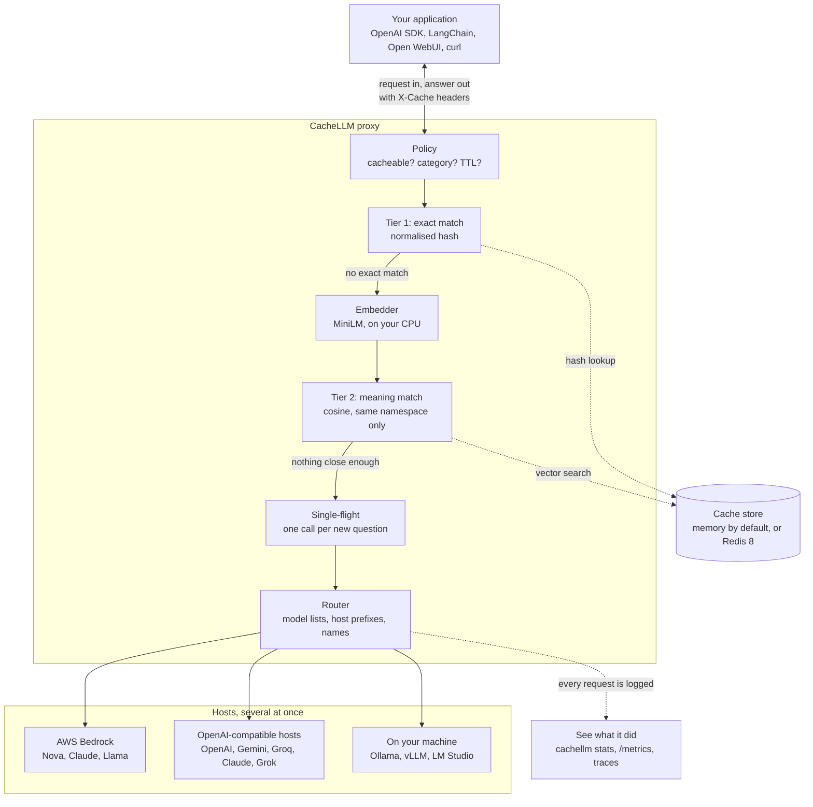
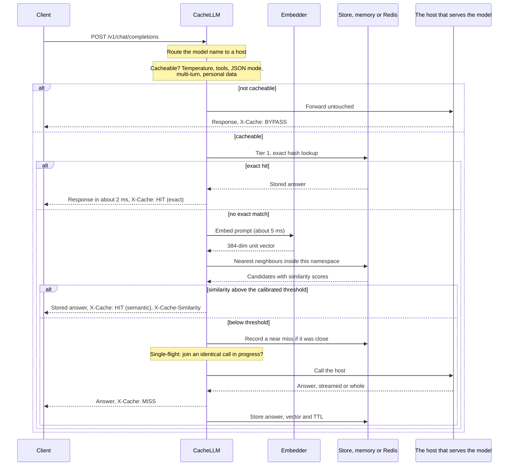

<div align="center">

# CacheLLM

### A drop-in semantic cache for LLM APIs. Point your app at it, and questions you have already paid for come back in milliseconds, from any provider you use.

[](https://github.com/adarshcod30/CacheLLM/actions/workflows/ci.yml)
[](https://pypi.org/project/cachellm-proxy/)
[](https://www.python.org/)
[](https://github.com/adarshcod30/CacheLLM/blob/main/LICENSE)
[](https://github.com/adarshcod30/CacheLLM/tree/main/tests)
[](https://github.com/adarshcod30/CacheLLM/tree/main/tests)
[](https://github.com/adarshcod30/CacheLLM/blob/main/docs/evaluation.md)
[](https://github.com/adarshcod30/CacheLLM/commits/main)

[**Install from PyPI**](https://pypi.org/project/cachellm-proxy/) &nbsp;·&nbsp; [**Watch the demo**](https://github.com/adarshcod30/CacheLLM/blob/main/docs/images/demo.gif) &nbsp;·&nbsp; [**Full evaluation**](https://github.com/adarshcod30/CacheLLM/blob/main/docs/evaluation.md) &nbsp;·&nbsp; [**Report a bug**](https://github.com/adarshcod30/CacheLLM/issues/new?template=bug_report.yml) &nbsp;·&nbsp; [**Request a feature**](https://github.com/adarshcod30/CacheLLM/issues/new?template=feature_request.yml)

</div>

<p align="center">
  
</p>

On a 2,000-request replay against **AWS Bedrock**, CacheLLM served **77% of traffic from cache** with **zero wrong answers** to 368 questions it had never seen, cut spend by **78%**, and brought the 95th percentile latency from 1,023 ms down to **5.7 ms**. One proxy routes each model to the host that serves it, and it has been checked live against Bedrock, Google Gemini, Groq and Ollama.

```bash
pip install cachellm-proxy
cachellm serve
```

---

## Table of contents

- [Overview](#overview)
- [Quick start](#quick-start)
- [Headline results](#headline-results)
- [Key features](#key-features)
- [Tech stack](#tech-stack)
- [How it works](#how-it-works)
- [Installation](#installation)
- [Using it from your app](#using-it-from-your-app)
- [Providers](#providers)
- [Where the cache lives](#where-the-cache-lives)
- [Seeing what it did](#seeing-what-it-did)
- [Configuration reference](#configuration-reference)
- [Command line reference](#command-line-reference)
- [HTTP API reference](#http-api-reference)
- [Data and evaluation pipeline](#data-and-evaluation-pipeline)
- [Results and model performance](#results-and-model-performance)
- [Deployment and infrastructure](#deployment-and-infrastructure)
- [Security and privacy](#security-and-privacy)
- [Troubleshooting](#troubleshooting)
- [Limitations](#limitations)
- [Project structure](#project-structure)
- [Testing](#testing)
- [Roadmap](#roadmap)
- [Contributing](#contributing)
- [License](#license)
- [Contact](#contact)

---

## Overview

**Problem.** Apps that call an LLM pay again and again for the same answer. Users ask the same questions in different words, support bots field the same twenty issues all day, and batch jobs re-classify near-identical rows. Each one is a fresh API call: real money, and one to three seconds a user waits. A normal cache barely helps, because changing one word changes the key.

**Solution.** CacheLLM is a small proxy that sits between your app and your models. It speaks the OpenAI API, so your app changes one line. It answers exact repeats from a hash lookup, reworded repeats by comparing meaning with a small local embedding model, and forwards everything else to whichever provider serves the model you asked for. It decides per request whether caching is safe at all, and it fails open: if anything breaks, requests still reach the model.

**Why it matters.** Most of the saving comes from traffic you already have. The measured cost reduction was 78% on a realistic workload, the cache never served a wrong answer to a genuinely new question in that run, and it runs on a laptop with nothing else installed. The same numbers and every failure found along the way are published, so you can judge it before trusting it.

**Keywords:** `semantic-cache` `llm-cache` `llm-proxy` `llmops` `caching` `cost-optimization` `openai-api` `vector-search` `aws-bedrock` `gemini` `groq` `ollama` `redis` `fastapi` `python`

---

## Quick start

You need Python 3.11 or newer. Nothing else: no Docker, no database, no config file.

**1. Install and start it.**

```bash
pip install cachellm-proxy
cachellm serve
```

On startup it finds every provider this machine can already use: API keys in their usual environment variables, Ollama if it is running, and AWS credentials for Bedrock. It logs what it found. The first start also downloads the small embedding model it uses for matching, about 90 MB, once.

**2. Point your app at it.** Change one line:

```python
from openai import OpenAI

client = OpenAI(base_url="http://localhost:8080/v1")  # was https://api.openai.com/v1
```

Everything else stays the same: the same request, the same response, the same errors, the same streaming.

**3. Watch it work.** Ask the same question twice, then a reworded version, and compare the headers:

```bash
curl -s -D- http://localhost:8080/v1/chat/completions -H 'Content-Type: application/json' -d '{"model":"fake/echo","temperature":0,"messages":[{"role":"user","content":"What is Redis used for?"}]}' | grep -i '^x-cache'
```

```bash
curl -s -D- http://localhost:8080/v1/chat/completions -H 'Content-Type: application/json' -d '{"model":"fake/echo","temperature":0,"messages":[{"role":"user","content":"explain what redis does"}]}' | grep -i '^x-cache'
```

You will see `X-Cache: MISS` the first time, `HIT` with `X-Cache-Tier: exact` on the repeat, and `HIT` with `X-Cache-Tier: semantic` and a similarity score on the rewording. The model `fake/echo` is a built-in test double, so this works with no account at all. Use your real model name, such as `gpt-5.6-luna` or `gemini-2.5-flash`, once a key is set.

**4. See the savings.**

```bash
cachellm stats
```

---

## Headline results

2,000 requests at concurrency 8 against **Amazon Nova Micro on AWS Bedrock**, from a laptop in India. Method, caveats and reproduction steps are in [docs/evaluation.md](https://github.com/adarshcod30/CacheLLM/blob/main/docs/evaluation.md).

| Metric | Result |
| --- | ---: |
| Hit rate | **77.0%**, against a ceiling of 79.6% for this workload |
| Wrong answers to genuinely new questions | **0 of 368** |
| Reworded repeats served from cache | 95.2% |
| Exact repeats served from cache | 99.3% |
| p95 latency, any cache hit | **5.7 ms** |
| p95 latency, reworded hit | 9.7 ms |
| p95 latency, model call | 1,022.8 ms |
| Cost reduction | **78.0%** |
| Throughput | 41.9 requests per second |
| Errors | 0 |

The hit rate climbed from 44% in the first hundred requests to 87% in the last hundred as the cache warmed. The whole run cost **$0.0038** in real Bedrock charges, because 1,540 of the 2,000 requests never reached the model. The same benchmark runs offline against the built-in test double and lands within half a point, at 77.2% with zero wrong answers, and CI asserts that version on every push.

Live checks against real providers, driven by the official OpenAI SDK:

| Provider | Models | Checks passed |
| --- | --- | --- |
| Google Gemini | `gemini-2.5-flash`, `models/gemini-3.5-flash` | 15 of 15 |
| Groq | `openai/gpt-oss-20b`, `openai/gpt-oss-120b` | 15 of 15 |
| Ollama, on the same laptop | `qwen2.5:0.5b` | 13 of 13 |
| All three through one proxy | five models across three hosts | 11 of 11 |

---

## Key features

| Feature | What it does | Why it exists |
| --- | --- | --- |
| **Drop-in OpenAI API** | Same request and response shape, streaming included. Checked with the official Python and Node.js SDKs and with LangChain | Adopting it has to cost one line, or nobody adopts it |
| **Several providers at once** | Routes each model to the host that serves it, using each host's live model list: OpenAI, Gemini, Groq, Claude, Grok, Ollama, Bedrock and more | Real apps mix vendors, and one cache should sit in front of all of them |
| **Runs with nothing installed** | The cache lives in a numpy matrix inside the proxy by default. Redis is optional | A cache that needs a server provisioned first does not get tried |
| **Two-tier matching** | An exact tier answers literal repeats without running any model. A semantic tier catches rewording | 82% of hits came from the exact tier: free, fast, and never semantically wrong |
| **Calibrated thresholds** | Ships the measured safe threshold for six embedding models and picks the right one | Safe thresholds span 0.89 to 0.98 across models. A copied threshold is a guess |
| **Cacheability policy** | Decides per request whether caching is safe, which category it is, and how long to keep it | Creative writing, live data and personal questions must not be cached like facts |
| **Personal-data guard** | Refuses to store prompts that look personal: emails, long digit runs, keys | Serving one user's answer to another is the failure that gets a cache removed |
| **Namespace isolation** | The system prompt, model, host, temperature and length limit all fold into the cache key | Two features, or two providers, must never share answers |
| **Stampede protection** | Identical misses that arrive together collapse into one upstream call | Ten users asking one new question should cost one generation |
| **Streaming both ways** | Misses stream through live, and hits replay as a stream, word for word | A cached answer must not break a client that asked for a stream |
| **Fails open** | If the cache or embedder breaks, requests still go through, uncached, and it says why | A cache that takes your app down is worse than no cache |
| **Shadow mode** | Records what it would have served, then calls the model anyway | Watch it on real traffic before trusting it |
| **Terminal dashboard** | `cachellm stats` and `cachellm watch` show hit rate, money saved and every request | No Grafana or extra services needed to see what it did |
| **Tuning tools** | Near-miss log, a threshold sweep endpoint, and `cachellm tune` for your own labelled pairs | Tune the threshold on your data instead of guessing |

---

## Tech stack

| Layer | Technology | Why this one |
| --- | --- | --- |
| API server | FastAPI on Uvicorn | Async and typed. Routing and bookkeeping cost a fraction of a millisecond, and embedding a new prompt about 5 ms |
| Embeddings | fastembed running `all-MiniLM-L6-v2` in ONNX, on CPU | Local, free and private. Measured best safe recall of six models tried |
| Default vector store | numpy, one matrix multiply per lookup | Faster than a network round trip below about 100,000 entries |
| Shared vector store, optional | Redis 8 with its search module, through RedisVL, HNSW index | Shared by several proxies, and survives restarts |
| Upstream clients | httpx for every OpenAI-compatible host, boto3 for Bedrock | One adapter covers every host except Bedrock, because they all speak one protocol |
| Configuration | pydantic-settings | Every setting is an environment variable or a `.env` line, validated at startup |
| Command line | Typer | `cachellm serve`, `stats`, `watch`, `route` and the rest |
| Observability | structlog, prometheus-client, OpenTelemetry (optional) | Readable logs by default, metrics and traces when you want them |
| Packaging | uv, published to PyPI with Trusted Publishing | No API token exists anywhere to leak |
| CI/CD | GitHub Actions | Lint, types, tests on three Python versions, real Redis, a clean install and a Docker boot |
| Containers, optional | Docker, Docker Compose with Prometheus and Grafana | For people who want them. Nothing requires them |
| Quality | pytest, ruff, mypy | 364 tests at 91% line coverage |

---

## How it works

### System architecture

Your app talks to CacheLLM exactly as it would talk to OpenAI. The proxy first decides whether this request may be cached at all. If it may, it tries a cheap exact-match lookup. Failing that, it embeds the prompt with a small local model and searches its store for the closest answer it has already paid for, but only among answers allowed to serve this system prompt, model and host. If nothing is close enough, the router forwards the request to whichever host serves that model, streams the answer back, and stores it for next time. Every request lands in a log that `cachellm stats` reads.



### Request flow

What happens to one request, from arrival to answer:



### Design choices, and why

- **Two tiers, exact first.** A normalised hash of the prompt costs no model call and cannot be semantically wrong. On Bedrock it produced 1,265 of 1,540 hits: 82% of all hits. The semantic tier added the other 275, close to 14 points of hit rate, and it is the tier that carries risk. Building the cheap, safe tier first is the difference between a demo and something you would deploy.
- **Similarity is a cosine over unit vectors.** Every embedding is normalised to length 1, so a dot product is the cosine similarity. Searching 20,000 cached prompts is one matrix multiply, about 0.85 ms.
- **The threshold depends on the model.** Each embedding model scores on its own scale. The safe threshold for MiniLM is 0.89, and for bge-small it is 0.96. CacheLLM ships the measured value for six models and applies a small offset per category: classification tolerates looser matching, creative writing almost none.
- **Namespaces decide who may share an answer.** The host, model, system prompt, temperature bucket, `top_p`, `max_tokens`, response format and stop sequences are hashed into a namespace, and a lookup only searches inside its own. Two features with different system prompts never share answers.
- **Truncated answers are never stored.** An answer that stopped because it hit `max_tokens` is not cached, because serving a cut-off answer forever is a silent quality bug. `/admin/stats` counts every refused write by reason.
- **Fail open.** If the store or the embedder cannot start, the proxy forwards every request upstream and reports itself degraded rather than failing.
- **One call per new question.** When identical misses arrive together, the first goes upstream and the rest wait for its answer.

### What is deliberately not cached

Each rule maps to a specific way a naive cache goes wrong. Each can be changed with a setting, and each shows up in the `X-Cache-Bypass-Reason` header.

| Bypass reason | When it applies | Setting |
| --- | --- | --- |
| `temperature_too_high` | Temperature above 0.3, where you asked for variety | `CACHELLM_MAX_CACHEABLE_TEMPERATURE` |
| `multiple_completions_requested` | `n` greater than 1 | always on |
| `tool_calls` | The request offers tools | `CACHELLM_CACHE_TOOL_CALLS` |
| `json_mode` | JSON object or JSON schema responses | `CACHELLM_CACHE_JSON_MODE` |
| `multi_turn_conversation` | More than one user turn, so earlier context matters | `CACHELLM_CACHE_MULTI_TURN` |
| `non_text_content` | Images or other non-text parts | always on |
| `prompt_too_long` | Over 8,000 characters | `CACHELLM_MAX_PROMPT_CHARS` |
| `pii:<kind>` | The prompt looks personal: an email, a long digit run, a key | `CACHELLM_PII_GUARD` |
| `client_requested_bypass` | The client sent `X-Cache-Control: no-store` or `no-cache` | per request |
| `cache_disabled` | Caching is switched off | `CACHELLM_ENABLED` |

---

## Installation

**Requirements.** Python 3.11, 3.12 or 3.13 on macOS, Linux or Windows. A CPU is enough: the embedding model runs locally and needs about 100 MB of memory. The first start downloads it, about 90 MB, from Hugging Face.

```bash
pip install cachellm-proxy
```

It is a command line tool, so an isolated install works well too:

```bash
pipx install cachellm-proxy
```

```bash
uv tool install cachellm-proxy
```

The package is called `cachellm-proxy` on PyPI, because PyPI blocks the shorter `cachellm` as too close to an existing name. The command and the Python import are both `cachellm`.

**Optional extras.** You only install what you route to:

| You want | Install |
| --- | --- |
| Any OpenAI-compatible host: OpenAI, Gemini, Groq, Claude, Ollama and the rest | `pip install cachellm-proxy` |
| AWS Bedrock | `pip install "cachellm-proxy[aws]"` |
| Redis instead of the in-process cache | `pip install "cachellm-proxy[redis]"` |
| Tracing to Langfuse, Tempo or Jaeger | `pip install "cachellm-proxy[observability]"` |
| Everything | `pip install "cachellm-proxy[all]"` |

Ask for a provider or store whose extra is missing and the proxy names the exact install command, instead of raising an import error.

**From source**, if you plan to change anything:

```bash
git clone https://github.com/adarshcod30/CacheLLM.git
cd CacheLLM
uv sync --all-extras
uv run cachellm serve
```

**With Docker**, which bakes the embedding model into the image so a new container does not download it on its first request:

```bash
docker build -t cachellm .
docker run -p 8080:8080 -e GROQ_API_KEY=gsk_your_key cachellm
```

The full stack, with Redis, Prometheus and a provisioned Grafana dashboard, is one command. Grafana then answers on `http://localhost:3000`:

```bash
make up
```

---

## Using it from your app

Anything that can talk to OpenAI can talk to CacheLLM. Point it at `http://localhost:8080/v1` and keep everything else. Each of these clients was run against the proxy while writing this page.

**Python, official OpenAI SDK**

```python
from openai import OpenAI

client = OpenAI(base_url="http://localhost:8080/v1", api_key="unused")
reply = client.chat.completions.create(
    model="gemini-2.5-flash",
    temperature=0,
    messages=[{"role": "user", "content": "What is Redis used for?"}],
)
print(reply.choices[0].message.content)
```

The `api_key` can be any string unless you turn on client keys, because your real provider keys stay with the proxy.

**Node.js or TypeScript, official OpenAI SDK**

```javascript
import OpenAI from "openai";

const client = new OpenAI({ baseURL: "http://localhost:8080/v1", apiKey: "unused" });
const reply = await client.chat.completions.create({
  model: "openai/gpt-oss-20b",
  temperature: 0,
  messages: [{ role: "user", content: "What is Redis used for?" }],
});
console.log(reply.choices[0].message.content);
```

**LangChain**

```python
from langchain_openai import ChatOpenAI

llm = ChatOpenAI(
    base_url="http://localhost:8080/v1", api_key="unused", model="gpt-5.6-luna", temperature=0
)
print(llm.invoke("Explain what a vector database does.").content)
```

**curl**

```bash
curl -s http://localhost:8080/v1/chat/completions -H 'Content-Type: application/json' -d '{"model":"qwen2.5:0.5b","temperature":0,"messages":[{"role":"user","content":"What is Redis used for?"}]}'
```

**Any other tool** that lets you set an OpenAI base URL, such as Open WebUI, a coding assistant or an agent framework, works the same way. `GET /v1/models` lists every model your hosts offer, so model pickers fill in on their own.

**Streaming** works unchanged. A miss streams from the host as it is generated. A hit replays the stored answer as a stream, character for character.

**Response headers** explain every decision:

| Header | Meaning |
| --- | --- |
| `X-Cache` | `HIT`, `MISS`, `BYPASS` or `SHADOW` |
| `X-Cache-Tier` | `exact` or `semantic`, on a hit |
| `X-Cache-Similarity` | Cosine similarity of the best match |
| `X-Cache-Threshold` | The threshold in force for this request's category |
| `X-Cache-Category` | `factual`, `classification`, `creative`, `volatile` or `conversational` |
| `X-Cache-Bypass-Reason` | Why it was not cached, when it was not |
| `X-Cache-Upstream` | Which host answered, or whose cached answer this is |
| `X-Cache-Saved-USD` | Modelled money this hit avoided |
| `X-Cache-Age-Seconds` | How old the served entry is |
| `X-Cache-Namespace`, `X-Cache-Entry-Id` | Which namespace and entry were involved |
| `X-Cache-Lookup-Ms`, `X-Cache-Latency-Ms` | Time spent deciding, and total time |
| `X-Cache-Coalesced` | Present when this request joined an identical call in progress |

The JSON body also carries a `cachellm` field with the same details. SDKs ignore unknown fields, so it never gets in the way.

**Per-request control** with the `X-Cache-Control` request header:

| Value | Effect |
| --- | --- |
| `no-store` or `no-cache` | Skip the cache for this request |
| `only-if-cached` | Return 504 instead of calling the host when there is no cached answer |

---

## Providers

Export the key your provider gave you, under its usual name, and start the proxy. It reads every key it recognises, so several providers work at once. Everything except Bedrock speaks the OpenAI protocol, so no extra is needed.

| Host | Key it reads | Base URL, if you set it yourself | Example model |
| --- | --- | --- | --- |
| AWS Bedrock | your AWS credentials, `aws` extra | n/a | `bedrock/us.amazon.nova-micro-v1:0` |
| Ollama, on this machine | none, found when it is running | `http://localhost:11434/v1` | `llama3.2` |
| vLLM, LM Studio, llama.cpp | none | `http://localhost:8000/v1` | whatever you serve |
| OpenAI | `OPENAI_API_KEY` or `OPENAI_KEY` | `https://api.openai.com/v1` | `gpt-5.6-luna` |
| Anthropic, Claude | `ANTHROPIC_API_KEY` | `https://api.anthropic.com/v1` | `claude-sonnet-5` |
| Google Gemini | `GEMINI_API_KEY` or `GOOGLE_API_KEY` or `GOOGLE_GENAI_API_KEY` | `https://generativelanguage.googleapis.com/v1beta/openai/` | `gemini-2.5-flash` |
| xAI, Grok | `XAI_API_KEY` | `https://api.x.ai/v1` | `grok-4.6` |
| Groq | `GROQ_API_KEY` | `https://api.groq.com/openai/v1` | `openai/gpt-oss-20b` |
| DeepSeek | `DEEPSEEK_API_KEY` | `https://api.deepseek.com/v1` | `deepseek-chat` |
| Mistral AI | `MISTRAL_API_KEY` | `https://api.mistral.ai/v1` | `mistral-large-latest` |
| OpenRouter | `OPENROUTER_API_KEY` | `https://openrouter.ai/api/v1` | `anthropic/claude-haiku-4.5` |
| Together | `TOGETHER_API_KEY` | `https://api.together.xyz/v1` | `meta-llama/Llama-3.3-70B-Instruct-Turbo` |
| Fireworks | `FIREWORKS_API_KEY` | `https://api.fireworks.ai/inference/v1` | `accounts/fireworks/models/llama-v3p3-70b-instruct` |
| Cerebras | `CEREBRAS_API_KEY` | `https://api.cerebras.ai/v1` | `llama3.1-8b` |
| Perplexity | `PERPLEXITY_API_KEY` | `https://api.perplexity.ai` | `sonar` |
| Moonshot, Kimi | `MOONSHOT_API_KEY` | `https://api.moonshot.ai/v1` | `kimi-k2-0905-preview` |

`cachellm providers` prints this list with what your machine can reach right now.

### One provider

```bash
export GROQ_API_KEY=gsk_your_key
cachellm serve
```

For a server of your own, such as vLLM, LM Studio or a company gateway, set the endpoint yourself. Then every request goes there, whatever other keys are exported:

```bash
CACHELLM_OPENAI_BASE_URL=http://localhost:8000/v1 cachellm serve
```

### Several providers at once

With keys for more than one host, one proxy serves all of them, and each request goes to the host that serves its model. This table comes from a live run with `GEMINI_API_KEY` and `GROQ_API_KEY` exported and Ollama running, all through a single proxy:

| Your app sends | Answered by | Because |
| --- | --- | --- |
| `gemini-2.5-flash` | Google Gemini | Gemini lists it |
| `models/gemini-3.5-flash-lite` | Google Gemini | Gemini lists it |
| `openai/gpt-oss-20b` | Groq | Groq lists it |
| `groq/openai/gpt-oss-120b` | Groq, as `openai/gpt-oss-120b` | an explicit host prefix |
| `qwen2.5:0.5b` | Ollama | Ollama lists it |
| `mistral/mistral-large-latest` | nobody, with an error naming `MISTRAL_API_KEY` | no key for that host |

Six rules decide, in order, and you never write a model list:

1. **`bedrock/` and `fake/`** pick the adapters this proxy owns.
2. **Bedrock's `vendor.model` ids**, like `amazon.nova-lite-v1:0`, go to Bedrock.
3. **A host's own model list.** At startup the proxy asks every host for its `/models`, so a name goes to the host that actually serves it. This is what sends `openai/gpt-oss-20b` to Groq. Lists refresh in the background when an unknown name turns up and they are more than ten minutes old.
4. **A host prefix**, LiteLLM style: `groq/openai/gpt-oss-120b` sends `openai/gpt-oss-120b` to Groq.
5. **Naming conventions**: `claude-` for Anthropic, `gemini-` for Gemini, `grok-` for xAI, `gpt-` and the `o` series for OpenAI, plus DeepSeek, Mistral, Perplexity and Moonshot names, when you have that host's key.
6. **Everything else** goes to the default host, which is the first one found.

Choose the hosts, and the default, with `CACHELLM_HOSTS`. The first one named is the default:

```bash
CACHELLM_HOSTS=groq,gemini cachellm serve
```

Check where any name would go while the proxy runs:

```bash
cachellm route openai/gpt-oss-20b
```

```
  openai/gpt-oss-20b
    goes to   Groq
    sent as   openai/gpt-oss-20b
    because   listed by Groq
```

Answers are cached per host, so one host's answer is never served for another. Models on your own machine count as free: a hit there saves time, not money. `anthropic.claude-…` with a dot is a Bedrock id, while `anthropic/claude-…` with a slash is an OpenRouter id, and the router tells them apart.

### AWS Bedrock

Bedrock does not speak the OpenAI protocol, so it has its own adapter. It needs the `aws` extra and uses your existing AWS credentials, with no vendor API key:

```bash
pip install "cachellm-proxy[aws]"
AWS_REGION=us-east-1 cachellm serve
```

```bash
curl -s http://localhost:8080/v1/chat/completions -H 'Content-Type: application/json' -d '{"model":"us.amazon.nova-micro-v1:0","temperature":0,"messages":[{"role":"user","content":"What is Redis used for?"}]}'
```

The region comes from `CACHELLM_AWS_REGION` if you set it, then `AWS_REGION`, then `AWS_DEFAULT_REGION`, then your AWS profile, then `us-east-1`. Credentials from `aws login` need AWS's CRT package, which the `aws` extra already includes.

### Models on your own machine

Start Ollama and the proxy finds it on its own. Ollama needs no key and its models cost nothing:

```bash
ollama pull qwen2.5:0.5b
cachellm serve
```

For vLLM, LM Studio or llama.cpp's server, set the endpoint as shown under [One provider](#one-provider).

---

## Where the cache lives

One setting, `CACHELLM_BACKEND`, with three values. Most people never touch it.

| Value | What happens | Choose it when |
| --- | --- | --- |
| `auto`, the default | Redis if the extra is installed and a usable server answers, the in-process cache otherwise | You have no opinion |
| `memory` | A numpy matrix inside the proxy. Nothing to install | One process: a laptop, a side project, a single server |
| `redis` | One Redis server shared by every copy of the proxy | Several processes must share one cache |

Memory is not the slow option. Below roughly 100,000 entries it is the faster one: scanning 20,000 cached prompts takes about 0.85 ms, while a Redis round trip alone costs 2 to 3 ms. Redis earns its place when several processes need one shared cache. Run four copies of the proxy on memory and you have four separate caches, each a quarter as warm.

Memory can survive a restart too. Give it a file, and it saves there on a clean shutdown and loads it back on start:

```bash
CACHELLM_MEMORY_SNAPSHOT_PATH=$HOME/.cachellm/cache.npz cachellm serve
```

**Setting up Redis.** Install the extra, then run a Redis 8 server:

```bash
pip install "cachellm-proxy[redis]"
```

```bash
brew install redis && brew services start redis
```

```bash
docker run -d -p 6379:6379 redis:8-alpine
```

The first server command is for macOS, and the second works anywhere with Docker. The server has two requirements, and both are checked at startup:

- **It needs the search module**, which stores and searches the vectors. Redis 8 from Homebrew or the official Docker image includes it. Many Linux distribution packages ship an older Redis without it, so prefer the Docker image there. A hosted Redis works if its plan includes search.
- **It has to be database 0**, because Redis search cannot index any other. Keep several apps apart with `CACHELLM_INDEX_NAME` instead.

If either is missing, `auto` uses memory and says exactly why, both in a startup warning and at the top of `cachellm stats`. With `CACHELLM_BACKEND=redis` the proxy never switches storage behind your back. It keeps answering without a cache and reports itself degraded until Redis is fixed.

**Sizing.** Each entry's vector is 384 numbers, 1.5 KB, plus the prompt and answer text. The in-memory store keeps up to 50,000 entries by default, about 73 MB of vectors, and evicts the least recently used beyond that.

---

## Seeing what it did

**In the terminal.** `cachellm stats` reads the running proxy and prints the whole picture. This is the Bedrock benchmark:

```
  CacheLLM · memory backend · all-MiniLM-L6-v2

  HIT RATE    77.0%  ████████████████░░░░░░  1,540 of 2,000 requests
             1,265 exact · 275 semantic · 460 missed · 0 bypassed

  SAVED      $0.0135   spent $0.0038  78% lower
             116,029 tokens never generated

  LATENCY    cached       2.6 ms p50 ·      5.7 ms p95
             uncached   797.0 ms p50 ·   1022.8 ms p95   179x faster

  CACHE      451 entries · 9 coalesced · 17 near misses

  time      result tier        latency  score  saved       prompt
  02:30:55  HIT    exact         1.2ms  1.000  +$0.000010  What is Redis used for?
  02:30:54  BYPASS             451.5ms    ·          ·     What is my order 1234…  (pii:long_digits)
  02:30:53  HIT    semantic      7.4ms  0.952  +$0.000011  What is Redis typically used for?
  02:30:53  MISS               454.8ms    ·          ·     How do I configure nginx for TLS?
```

`cachellm watch` follows requests live, like `tail -f`. Both read the proxy over HTTP, because with the in-memory store the cache lives inside the serving process.

**Money saved** is a model, not a bill: the tokens a hit avoided, priced at the host's list price. Prices for OpenAI, Gemini, Groq, Bedrock and others ship built in, models on your own machine count as free, and `CACHELLM_PRICING_FILE` points at a JSON file of your own prices:

```json
{"my-model": {"input_per_m": 0.20, "output_per_m": 0.80}}
```

**Operator endpoints** give the same view as JSON. See the [HTTP API reference](#http-api-reference).

**Prometheus.** `GET /metrics` serves these, when `CACHELLM_METRICS_ENABLED` is on:

| Metric | What it counts |
| --- | --- |
| `cachellm_requests_total` | Requests, by cache outcome |
| `cachellm_request_duration_seconds` | End-to-end request duration |
| `cachellm_lookup_duration_seconds` | Time deciding hit or miss: policy, embedding, search |
| `cachellm_embed_duration_seconds` | Time embedding the prompt |
| `cachellm_similarity` | Best similarity seen at lookup time |
| `cachellm_tokens_total` | Tokens spent upstream or avoided |
| `cachellm_cost_usd_total` | Modelled dollars spent and saved |
| `cachellm_cache_entries` | Entries currently stored |
| `cachellm_provider_errors_total` | Upstream failures, by host |
| `cachellm_coalesced_total` | Requests that joined an identical call in progress |
| `cachellm_near_miss_total` | Lookups just below the threshold |
| `cachellm_shadow_hits_total` | Hits that shadow mode would have served |

`make up` starts Prometheus and a Grafana dashboard with eleven panels, already provisioned. Grafana is optional, and nothing else depends on it.


**Tracing.** Install the `observability` extra, set `CACHELLM_TRACING_ENABLED=true` and an OTLP endpoint, and every request becomes a span in Langfuse, Tempo or Jaeger. For Langfuse, use its OTLP endpoint and put the basic-auth header in `OTEL_EXPORTER_OTLP_HEADERS`.

**Logs** are structured JSON by default, or readable lines with `CACHELLM_LOG_JSON=false`. Prompt and answer text never reaches the logs unless you set `CACHELLM_LOG_PROMPTS=true`. Provider keys never reach them at all, and the live checks fail if one does.

---

## Configuration reference

Every setting is an environment variable starting `CACHELLM_`, or a line in a `.env` file in the directory you start it from. Start from [.env.example](https://github.com/adarshcod30/CacheLLM/blob/main/.env.example). `cachellm config` prints the effective values, with secrets hidden.

<details>
<summary><b>Server</b> (5 settings)</summary>

| Variable | Default | What it does |
| --- | --- | --- |
| `CACHELLM_HOST` | `127.0.0.1` | Address to listen on. Use `0.0.0.0` to accept other machines, and set client keys when you do |
| `CACHELLM_PORT` | `8080` | Port to listen on |
| `CACHELLM_LOG_LEVEL` | `INFO` | `DEBUG`, `INFO`, `WARNING` or `ERROR` |
| `CACHELLM_LOG_JSON` | `True` | JSON log lines. `false` gives readable lines for a terminal |
| `CACHELLM_LOG_PROMPTS` | `False` | Write prompt and answer text into logs. Off by default |

</details>

<details>
<summary><b>Client authentication</b> (2 settings)</summary>

| Variable | Default | What it does |
| --- | --- | --- |
| `CACHELLM_API_KEYS` | empty | Comma-separated keys that clients must send as a bearer token. Empty turns auth off, for local use only |
| `CACHELLM_REQUIRE_AUTH_FOR_ADMIN` | `True` | When client keys are set, the admin endpoints need one too |

</details>

<details>
<summary><b>Storage</b> (3 settings)</summary>

| Variable | Default | What it does |
| --- | --- | --- |
| `CACHELLM_BACKEND` | `auto` | `auto`, `memory` or `redis`. See [Where the cache lives](#where-the-cache-lives) |
| `CACHELLM_MEMORY_MAX_ENTRIES` | `50000` | Most entries kept in memory. Least recently used go first |
| `CACHELLM_MEMORY_SNAPSHOT_PATH` | empty | File the in-memory cache is saved to on a clean shutdown and loaded from on start |

</details>

<details>
<summary><b>Redis</b> (5 settings)</summary>

| Variable | Default | What it does |
| --- | --- | --- |
| `CACHELLM_REDIS_URL` | `redis://localhost:6379/0` | Must be database 0, on a server with the search module |
| `CACHELLM_INDEX_NAME` | `cachellm_idx` | Search index name. Give each app its own to share one Redis |
| `CACHELLM_ENTRY_PREFIX` | `cachellm:e:` | Key prefix for stored entries |
| `CACHELLM_EXACT_PREFIX` | `cachellm:x:` | Key prefix for exact-match keys |
| `CACHELLM_STATS_PREFIX` | `cachellm:s:` | Key prefix for counters and logs |

</details>

<details>
<summary><b>Embeddings</b> (4 settings)</summary>

| Variable | Default | What it does |
| --- | --- | --- |
| `CACHELLM_EMBEDDING_BACKEND` | `fastembed` | `fastembed` runs a real model. `hash` is a stand-in for tests that cannot match by meaning |
| `CACHELLM_EMBEDDING_MODEL` | `sentence-transformers/all-MiniLM-L6-v2` | Any fastembed model. Six have calibrated thresholds built in |
| `CACHELLM_EMBEDDING_DIM` | `384` | Vector size for the `hash` backend. Real models report their own |
| `CACHELLM_EMBEDDING_CACHE_SIZE` | `2048` | Recent prompts whose vectors are kept, so a repeated wording is embedded once |

</details>

<details>
<summary><b>Caching, thresholds and lifetimes</b> (21 settings)</summary>

| Variable | Default | What it does |
| --- | --- | --- |
| `CACHELLM_ENABLED` | `True` | Master switch. Off forwards every request untouched |
| `CACHELLM_SHADOW_MODE` | `False` | Record what the cache would have served, then call the host anyway |
| `CACHELLM_CACHE_STREAMING` | `True` | Store answers from streamed misses too |
| `CACHELLM_CACHE_TRUNCATED` | `False` | Store answers that stopped at `max_tokens`. Off, because a cut-off answer cached forever is a silent bug |
| `CACHELLM_TOP_K` | `3` | Nearest neighbours examined per lookup |
| `CACHELLM_NEAR_MISS_MARGIN` | `0.06` | A miss this close to the threshold is logged as a near miss |
| `CACHELLM_NEAR_MISS_LOG_SIZE` | `500` | Recent near misses kept |
| `CACHELLM_REQUEST_LOG_SIZE` | `500` | Recent requests kept for `cachellm stats` and `cachellm watch` |
| `CACHELLM_THRESHOLD_DEFAULT` | `0.0` | Similarity needed for a hit. `0` uses the calibrated value for your embedding model |
| `CACHELLM_THRESHOLD_FACTUAL` | `0.0` | Override for factual questions. `0` uses the calibrated value |
| `CACHELLM_THRESHOLD_CLASSIFICATION` | `0.0` | Override for classification. `0` uses the calibrated value |
| `CACHELLM_THRESHOLD_CREATIVE` | `0.0` | Override for creative writing. `0` uses the calibrated value |
| `CACHELLM_THRESHOLD_VOLATILE` | `0.0` | Override for questions about the present. `0` uses the calibrated value |
| `CACHELLM_THRESHOLD_CONVERSATIONAL` | `0.0` | Override for conversational prompts. `0` uses the calibrated value |
| `CACHELLM_CATEGORY_THRESHOLD_OFFSETS` | see description | JSON object of offsets added to the calibrated threshold per category |
| `CACHELLM_TTL_DEFAULT` | `86400` | Seconds an entry lives: one day |
| `CACHELLM_TTL_FACTUAL` | `604800` | Seconds for stable facts: seven days |
| `CACHELLM_TTL_CLASSIFICATION` | `604800` | Seconds for classification: seven days |
| `CACHELLM_TTL_CREATIVE` | `3600` | Seconds for creative writing: one hour |
| `CACHELLM_TTL_VOLATILE` | `900` | Seconds for anything about now: fifteen minutes |
| `CACHELLM_TTL_CONVERSATIONAL` | `3600` | Seconds for conversational prompts: one hour |

</details>

<details>
<summary><b>What may be cached</b> (7 settings)</summary>

| Variable | Default | What it does |
| --- | --- | --- |
| `CACHELLM_MAX_CACHEABLE_TEMPERATURE` | `0.3` | Above this temperature nothing is cached |
| `CACHELLM_MAX_PROMPT_CHARS` | `8000` | Longer prompts are not cached |
| `CACHELLM_CACHE_MULTI_TURN` | `False` | Cache conversations with more than one user turn |
| `CACHELLM_CACHE_JSON_MODE` | `False` | Cache JSON mode and JSON schema responses |
| `CACHELLM_CACHE_TOOL_CALLS` | `False` | Cache requests that offer tools |
| `CACHELLM_PII_GUARD` | `True` | Refuse to store prompts that look personal |
| `CACHELLM_STRIP_FILLER_WORDS` | `False` | Drop filler words before embedding. Raises hit rate, and slightly raises risk |

</details>

<details>
<summary><b>Providers and routing</b> (11 settings)</summary>

| Variable | Default | What it does |
| --- | --- | --- |
| `CACHELLM_DEFAULT_PROVIDER` | `openai` | `openai`, `bedrock` or `fake`. Setting it turns off auto-detection |
| `CACHELLM_AWS_REGION` | empty | Bedrock region. Empty uses `AWS_REGION`, `AWS_DEFAULT_REGION`, the profile, then `us-east-1` |
| `CACHELLM_AWS_PROFILE` | empty | AWS profile for Bedrock. Empty uses AWS's usual default |
| `CACHELLM_FAKE_LATENCY_MS` | `0.0` | Simulated delay for the built-in test double, for realistic offline benchmarks |
| `CACHELLM_OPENAI_BASE_URL` | `https://api.openai.com/v1` | One endpoint of your own. Setting it sends every request there |
| `CACHELLM_OPENAI_API_KEY` | empty | Key for that endpoint. Empty uses a known host's own variable |
| `CACHELLM_HOSTS` | empty | Hosts to route between, such as `groq,gemini`. The first is the default. Empty means every host found |
| `CACHELLM_DISCOVER_MODELS` | `True` | Ask each host for its model list at startup |
| `CACHELLM_DISCOVER_TIMEOUT` | `4.0` | Seconds to wait for each host's model list |
| `CACHELLM_REQUEST_TIMEOUT` | `120.0` | Seconds before an upstream call is abandoned |
| `CACHELLM_PROVIDER_MAX_RETRIES` | `2` | Retry attempts for Bedrock calls |

</details>

<details>
<summary><b>Observability</b> (4 settings)</summary>

| Variable | Default | What it does |
| --- | --- | --- |
| `CACHELLM_METRICS_ENABLED` | `True` | Serve Prometheus metrics at `/metrics` |
| `CACHELLM_TRACING_ENABLED` | `False` | Send OpenTelemetry spans. Needs the `observability` extra |
| `CACHELLM_OTLP_ENDPOINT` | empty | Where spans go. Falls back to `OTEL_EXPORTER_OTLP_ENDPOINT` |
| `CACHELLM_SERVICE_NAME` | `cachellm` | Service name on spans |

</details>

The default per-category offsets are `classification` minus 0.02, `factual` 0, `conversational` plus 0.03, `volatile` plus 0.03 and `creative` plus 0.06.

**Read from the environment, outside the `CACHELLM_` prefix:**

| Variable | Used for |
| --- | --- |
| `OPENAI_API_KEY`, `ANTHROPIC_API_KEY`, `GEMINI_API_KEY` or `GOOGLE_API_KEY`, `XAI_API_KEY`, `GROQ_API_KEY`, `DEEPSEEK_API_KEY`, `MISTRAL_API_KEY`, `OPENROUTER_API_KEY`, `TOGETHER_API_KEY`, `FIREWORKS_API_KEY`, `CEREBRAS_API_KEY`, `PERPLEXITY_API_KEY`, `MOONSHOT_API_KEY` | Each one found becomes a route |
| `AWS_REGION`, `AWS_DEFAULT_REGION`, `AWS_PROFILE` and the usual AWS credential chain | Bedrock |
| `CACHELLM_PRICING_FILE` | A JSON file of model prices that replaces the built-in ones |
| `OTEL_EXPORTER_OTLP_ENDPOINT`, `OTEL_EXPORTER_OTLP_HEADERS` | Where traces go, and their auth header |
| `FASTEMBED_CACHE_PATH` | Where the embedding model is kept. By default it sits in the system temp folder, which some systems clear |
| `NO_COLOR` | Plain output from the command line |

---

## Command line reference

| Command | What it does | Options |
| --- | --- | --- |
| `cachellm serve` | Run the proxy | `--host`, `--port`, `--reload` |
| `cachellm providers` | Every supported host, and which ones this proxy will route to | |
| `cachellm route MODEL` | Which host a model name goes to, what it receives, and why | `--url` |
| `cachellm stats` | Hit rate, savings, latency and recent requests | `--url`, `--limit`, `--json` |
| `cachellm watch` | Follow requests live | `--url`, `--interval` |
| `cachellm invalidate` | Remove entries by namespace, by model, or all of them | `--namespace`, `--model`, `--all`, `--url` |
| `cachellm tune PAIRS.jsonl` | Sweep similarity thresholds over your own labelled pairs | `--output` |
| `cachellm config` | Print the effective configuration, secrets hidden | |
| `cachellm version` | Print the installed version | |

`route`, `stats`, `watch` and `invalidate` talk to the running proxy, on `http://127.0.0.1:8080` unless you pass `--url`. If client keys are set, they send the first one.

`cachellm tune` reads one JSON object per line, and tells you which threshold serves the most duplicates without serving a single different question:

```json
{"a": "how do I reset my password", "b": "password reset steps", "duplicate": true}
{"a": "how do I enable 2FA", "b": "how do I disable 2FA", "duplicate": false}
```

---

## HTTP API reference

Interactive documentation for every endpoint is served at `http://localhost:8080/docs`.

**The OpenAI-compatible endpoints**

| Method | Endpoint | What it does |
| --- | --- | --- |
| `POST` | `/v1/chat/completions` | The drop-in endpoint. Accepts the OpenAI body unchanged, streaming included. Unknown fields pass through |
| `GET` | `/v1/models` | Every model your hosts offer, each with the host that owns it |

Errors use OpenAI's shape, so SDK error handling keeps working:

```json
{"error": {"message": "...", "type": "invalid_request_error", "param": "model", "code": "host_not_enabled"}}
```

**Operator endpoints**

| Method | Endpoint | What it does |
| --- | --- | --- |
| `GET` | `/admin/stats` | Hit rate, tier split, money saved, latency percentiles, entry count, and notes such as why Redis was passed over |
| `GET` | `/admin/requests?limit=50` | The recent request log that `cachellm stats` reads |
| `GET` | `/admin/providers` | The routes in use, how many models each host listed, and every supported host |
| `GET` | `/admin/route/{model}` | Which host one model name goes to, what it receives, and why |
| `GET` | `/admin/config` | Effective thresholds, lifetimes and rules |
| `POST` | `/admin/invalidate` | Drop entries by `namespace`, by `model`, or `all` |
| `GET` | `/admin/entries?limit=20` | Inspect what is stored |
| `GET` | `/admin/near-misses` | Recent lookups that landed just below the threshold |
| `GET` | `/admin/near-miss-histogram` | What a lower threshold would have served |
| `POST` | `/admin/threshold-sweep` | Score your own labelled pairs across thresholds |
| `POST` | `/admin/reset-stats` | Clear the counters |
| `GET` | `/healthz`, `/readyz` | Liveness, and readiness that reports a degraded cache rather than failing |
| `GET` | `/metrics` | Prometheus metrics |

Drop every entry for one model:

```bash
curl -s -X POST http://localhost:8080/admin/invalidate -H 'Content-Type: application/json' -d '{"model":"gemini-2.5-flash"}'
```

Score your own pairs:

```bash
curl -s http://localhost:8080/admin/threshold-sweep -H 'Content-Type: application/json' -d '{"pairs":[{"a":"how do I reset my password","b":"password reset steps","duplicate":true},{"a":"how do I enable 2FA","b":"how do I disable 2FA","duplicate":false}]}'
```

When `CACHELLM_API_KEYS` is set, send one as `Authorization: Bearer <key>` on every call, admin endpoints included.

---

## Data and evaluation pipeline

A semantic cache is only as trustworthy as its evidence that it will not serve the wrong answer. This is how that evidence was built. The full write-up, including the results that went against the design, is in [docs/evaluation.md](https://github.com/adarshcod30/CacheLLM/blob/main/docs/evaluation.md).

### 1. Data sources and collection

- **A labelled corpus of question pairs**, hand-built in `eval/corpus.py`: 40 groups of paraphrases covering 120 prompts, plus 35 **hard negatives**. A hard negative is a pair one word apart with a different meaning, like "undo the last git commit" against "undo the last git merge". That gives 193 labelled pairs: 123 duplicates and 70 non-duplicates. Any cache scores well on paraphrases alone, so the hard negatives are the real test.
- **A realistic workload** for load testing, generated by `bench/workload.py`: 2,000 requests over 483 unique prompts, with a 4.1x repeat factor, popularity skewed so a few questions dominate as real traffic does, and an 18% long tail of genuinely new questions that must never be served from cache.
- **Live traffic** against AWS Bedrock, Google Gemini, Groq and a local Ollama, through the real proxy.

### 2. Cleaning and normalisation

- **For the exact tier**, each prompt is Unicode-normalised, lowercased, has its whitespace collapsed and its trailing punctuation dropped, then hashed. "What is Redis?" and "what is redis" become the same key.
- **Unsafe requests are filtered out before they reach the cache**: high temperature, tools, JSON mode, multi-turn conversations, non-text content, long prompts and anything that looks personal. See [What is deliberately not cached](#what-is-deliberately-not-cached).
- **Each request gets a category** by rule: `volatile` for anything about the present, `creative` for writing tasks, `classification` for labelling tasks and very short answers, `conversational` for multi-turn, and `factual` otherwise. The category sets both the threshold offset and the lifetime.
- **Truncated answers are dropped.** An answer that stopped at `max_tokens` is never stored.

### 3. Transformation and features

- **Embeddings.** `all-MiniLM-L6-v2`, run locally through ONNX, turns each prompt into 384 numbers that capture its meaning. Vectors are normalised to length 1, so a dot product is the cosine similarity.
- **Exact-match features** are hashed into the namespace rather than embedded: host, model, system prompt, temperature rounded to one decimal, `top_p`, `max_tokens`, response format and stop sequences. A lookup can only match inside its own namespace.

### 4. Model selection and calibration

No model is trained. The embedding models are used as published, and what is fitted is the decision rule on top of them.

- **Six embedding models were compared** on the corpus: MiniLM, gte-base, jina-v2-small, bge-base, Arctic-embed-s and bge-small.
- **For each model, every threshold from 0.50 to 1.00 in steps of 0.01 was scored**, and the chosen operating point is the one with the most recall while serving **zero** hard negatives. Average accuracy was deliberately not the target: one wrong answer served confidently costs more than many missed hits.
- **MiniLM won** on that measure and became the default. The six calibrated thresholds ship in code, and the proxy picks the one that matches your embedding model.
- **Per-category offsets** tighten or loosen the threshold: creative writing gets the strictest, classification the loosest.
- **A lexical overlap guard was tried and rejected.** Requiring matched prompts to share words sounds safe, but hard negatives share *more* words than real paraphrases do, 0.42 on average, because they differ by exactly one decisive word.

### 5. Evaluation

- **On pairs:** recall, precision, F1, false-positive rate and hard-negative hits at each threshold.
- **On the workload:** hit rate against the workload's ceiling, wrong answers served to genuinely new questions, latency percentiles split by exact hit, reworded hit and miss, cost reduction and throughput.
- **Validation:** the long tail of new questions is held out by construction, and none may hit. The same workload runs against a real provider and the offline test double, and the two must agree. CI replays 300 requests on every push and fails the build if the hit rate collapses or any new question gets served.

---

## Results and model performance

**Embedding models**, scored on the labelled corpus:

| Model | Dimensions | Safe threshold | Recall at that threshold | Embed ms, median | Embed ms, p95 |
| --- | ---: | ---: | ---: | ---: | ---: |
| `all-MiniLM-L6-v2` (default) | 384 | **0.89** | **35.0%** | 5.5 | 6.0 |
| `gte-base` | 768 | 0.96 | 26.0% | 20.7 | 23.7 |
| `jina-embeddings-v2-small-en` | 512 | 0.96 | 16.3% | 1.7 | 2.0 |
| `bge-base-en-v1.5` | 768 | 0.94 | 11.4% | 7.5 | 10.0 |
| `snowflake-arctic-embed-s` | 384 | 0.98 | 11.4% | 2.7 | 3.2 |
| `bge-small-en-v1.5` | 384 | 0.96 | 8.1% | 3.0 | 4.0 |

Embed times are for one real question, cache off, on an Apple M4, best of three rounds. MiniLM gives four times the safe recall of bge-small, which is the model most tutorials reach for.

**The load test**, against a real provider and the offline double:

| Metric | Bedrock, Nova Micro | Offline test double |
| --- | ---: | ---: |
| Hit rate | **77.0%** | 77.2% |
| Workload ceiling | 79.6% | 79.6% |
| Exact-tier hits | 1,265 | 1,347 |
| Semantic-tier hits | 275 | 198 |
| Wrong answers to new questions | **0 of 368** | 0 |
| Throughput | 41.9 req/s | 55.6 req/s |
| Real spend | **$0.0038** | $0 |

| Latency, Bedrock run | p50 | p95 | p99 |
| --- | ---: | ---: | ---: |
| Exact hit | 2.5 ms | 4.9 ms | 6.6 ms |
| Reworded hit | 3.5 ms | 9.7 ms | 14.5 ms |
| Any hit | 2.6 ms | **5.7 ms** | 10.2 ms |
| Model call | 797.0 ms | 1,022.8 ms | 1,351.8 ms |

**What these numbers mean in practice.** Most of the value comes from the boring tier: exact repeats are four in five hits and cost nothing to serve. Rewording is where the risk lives, so its threshold is set to serve no wrong answers on the hardest cases found, at the price of missing some real rewordings. On realistic traffic that trade still served 95.2% of reworded repeats, because once one wording is cached, its later repeats hit exactly.

Three findings shaped the design:

1. **Similar is not the same.** "Undo the last git commit" and "undo the last git merge" score 0.95 with a popular embedding model, while "What is CORS?" and "Explain cross origin resource sharing" score 0.58. No model tested separated paraphrases from one-word opposites cleanly.
2. **Thresholds do not transfer.** The safe threshold ran from 0.89 to 0.98 across six models, which is why it is calibrated per model instead of set once.
3. **The first benchmark flattered itself.** It reported 79.1%, and 37 supposedly new questions hit the cache. They were not new: the generator had emitted several wordings per topic. Fixed to one wording per topic, false hits fell to zero and the headline dropped to 77.2%. The lower number is the honest one.

Reproduce any of it:

```bash
make tune            # threshold sweep on the corpus
make compare-models  # the six embedding models
make bench           # the 2,000-request load test, against a running proxy
```

---

## Deployment and infrastructure

**Where it runs.** Anywhere Python 3.11 runs: a laptop, one small VM, or a container. One gigabyte of memory is plenty, since the embedding model takes about 100 MB and the cache is whatever size you allow.

**As a service on Linux**, with systemd:

```ini
[Unit]
Description=CacheLLM semantic cache
After=network-online.target

[Service]
User=cachellm
EnvironmentFile=/etc/cachellm.env
ExecStart=/opt/cachellm/.venv/bin/cachellm serve
Restart=on-failure

[Install]
WantedBy=multi-user.target
```

Put provider keys, `CACHELLM_API_KEYS` and any other settings in `/etc/cachellm.env`, one `NAME=value` per line.

**In a container.** The image bakes in the embedding model and has a health check. `make up` runs it with Redis, Prometheus and Grafana. Compose passes common provider keys through, so name the hosts you want:

```bash
CACHELLM_HOSTS=groq,gemini GROQ_API_KEY=gsk_your_key GEMINI_API_KEY=your_key make up
```

**Several processes.** Use Redis so they share one cache, and start as many workers as you like:

```bash
CACHELLM_BACKEND=redis uvicorn cachellm.api.app:create_app --factory --workers 4 --host 0.0.0.0 --port 8080
```

The stampede guard works per process, so with four workers a brand-new question can reach the host up to four times at once, once per worker, instead of once per request.

**Before real traffic:**

1. Set `CACHELLM_API_KEYS` and put the proxy behind TLS, such as nginx or Caddy, if anything other than localhost can reach it.
2. Start with `CACHELLM_SHADOW_MODE=true` for a few days. It records what it would have served without serving it.
3. Read `/admin/near-misses` and run `/admin/threshold-sweep` on pairs from your own logs.
4. Turn shadow mode off.

**CI/CD.** GitHub Actions runs seven jobs on every push:

| Job | What it proves |
| --- | --- |
| Lint | ruff and mypy are clean |
| Tests, Python 3.11, 3.12 and 3.13 | the full suite, against a real Redis 8 |
| End-to-end smoke test | a real proxy with the real embedding model replays 300 requests, with semantic hits and zero wrong answers |
| Runs with nothing installed | a plain `pip install` serves requests with the in-memory store |
| Docker | the image builds and passes its health check |

**Releases** happen by pushing a version tag. The release workflow checks the tag matches the code's version, builds and verifies the package, publishes to PyPI through [Trusted Publishing](https://docs.pypi.org/trusted-publishers/), so no API token exists anywhere, and creates the GitHub release. See [docs/publishing.md](https://github.com/adarshcod30/CacheLLM/blob/main/docs/publishing.md).

**Environments.** Local development uses `make dev` with auto-reload. CI uses a deterministic hashing embedder and the test double, so no model download or account is needed, except the smoke test, which runs the real embedding model. Production is the same package with your keys and settings.

**Monitoring.** `cachellm stats` for a quick look, `/admin/stats` for scripts, `/metrics` for Prometheus alerts, and `/readyz` for load balancers. A broken cache shows as degraded in `/readyz` while requests keep flowing.

---

## Security and privacy

- **Your data stays where you put it.** Embeddings are computed on your machine. Prompts and answers are stored only in the proxy's memory, your own Redis, or a snapshot file you chose. Nothing is sent anywhere except to the host serving the request.
- **Provider keys** are read from the environment and only ever sent to their own host. They never appear in logs, and the live checks fail if one does. `cachellm config` hides them.
- **Client access** is off by default and the proxy listens on `127.0.0.1` only. Set `CACHELLM_API_KEYS` before exposing it. Keys are compared in constant time, and admin endpoints require one too.
- **Personal data** is kept out of the cache by the personal-data guard, and prompt text stays out of the logs unless you opt in.
- **Per request**, `X-Cache-Control: no-store` keeps anything sensitive out of the cache.

Found a vulnerability? Please follow [SECURITY.md](https://github.com/adarshcod30/CacheLLM/blob/main/SECURITY.md) instead of opening a public issue.

---

## Troubleshooting

| Symptom | Likely cause | Fix |
| --- | --- | --- |
| `cachellm stats` says no proxy is answering | The proxy is not running, or runs elsewhere | Start `cachellm serve`, or pass `--url` |
| Every request fails with a 401 from the host | No key, or a wrong one, for that host | Export the key, then check `cachellm providers` |
| "The model ... does not exist" | The name went to a host that does not serve it | Run `cachellm route <model>`, and add a host prefix such as `groq/` if needed |
| 400 with code `host_not_enabled` | The prefix names a host with no key | Set that host's key, and add it to `CACHELLM_HOSTS` if you set that |
| Gemini says a model is "no longer available to new users" | Google still lists some 2.5 models but refuses them to new accounts | Use `gemini-2.5-flash` or a 3.x model |
| Groq returns 429, "Request too large" | The free tier counts `max_tokens` against a per-minute limit | Send a smaller `max_tokens`, such as 512 |
| Startup warning: Redis has no search module | A distribution Redis without the search module | Use Redis 8 from Homebrew or the official Docker image |
| Startup warning about database 1 or higher | Redis search only indexes database 0 | End `CACHELLM_REDIS_URL` with `/0` |
| Low hit rate | Requests are bypassed, or answers are cut off | Read `X-Cache-Bypass-Reason` and the diagnostics in `/admin/stats`. Raise `max_tokens` if answers stop early |
| Low hit rate with several workers | Each worker has its own in-memory cache | Use `CACHELLM_BACKEND=redis` |
| First start takes a minute | The embedding model downloads once, about 90 MB | Set `FASTEMBED_CACHE_PATH` to keep it somewhere permanent |
| Bedrock says a dependency is missing | Credentials from `aws login` need AWS's CRT package | `pip install "cachellm-proxy[aws]"` |
| Bedrock uses the wrong region | The region comes from the environment | Set `AWS_REGION`, or `CACHELLM_AWS_REGION` to override |

---

## Limitations

- **Meaning is approximate.** No embedding model tested separates paraphrases from one-word opposites cleanly, so the thresholds are conservative. The semantic tier misses some real rewordings on purpose.
- **Your app knows things the cache does not.** The rules keep out personal, creative and time-sensitive prompts, but they cannot know that "my balance" is personal in your product. Send `X-Cache-Control: no-store` for anything like that.
- **One cache per process in memory.** Several workers need Redis to share a cache, and the stampede guard does not coordinate across processes yet.
- **Listed does not mean usable.** A host may list a model your account cannot call. Routing follows the list, and the host's own error comes back.
- **Live-checked providers so far:** AWS Bedrock, Google Gemini, Groq and Ollama. The other hosts share the same adapter and its tests, but have not been run against the real service.
- **Chat completions only.** Embeddings, images and audio pass through untouched or are not supported.
- **The corpus is small.** 193 hand-built pairs catch the failure that matters, but a larger public dataset is on the roadmap.

---

## Project structure

```
CacheLLM/
├── src/cachellm/
│   ├── cli.py                  # serve, providers, route, stats, watch, invalidate, tune, config
│   ├── settings.py             # every setting, and calibrated thresholds per embedding model
│   ├── report.py               # the terminal dashboard
│   ├── pricing.py              # list prices behind "money saved", overridable
│   ├── tuning.py               # threshold sweep over labelled pairs
│   ├── models.py               # OpenAI-shaped request and response schemas
│   ├── errors.py               # OpenAI-shaped errors
│   ├── api/
│   │   ├── app.py              # app assembly, health, metrics, error handling
│   │   ├── routes_chat.py      # the drop-in endpoint, streaming both ways
│   │   ├── routes_admin.py     # stats, routes, invalidation, near misses, sweep
│   │   ├── deps.py             # startup: routes, store, embedder, fail-open wiring
│   │   ├── auth.py             # constant-time client key check
│   │   └── sse.py              # server-sent event framing
│   ├── cache/
│   │   ├── service.py          # lookup, store, invalidate, stats
│   │   ├── policy.py           # cacheable? which category? how long?
│   │   ├── keys.py             # normalisation, namespaces, exact hashes
│   │   ├── memory.py           # the in-memory store, the default
│   │   ├── vector_store.py     # the Redis vector index
│   │   ├── exact_store.py      # Redis exact-match keys
│   │   ├── coalesce.py         # one upstream call per new question
│   │   ├── analytics.py        # counters, request log, near misses
│   │   └── entry.py            # the stored record
│   ├── embeddings/             # fastembed backend, and a hashing backend for tests
│   ├── providers/
│   │   ├── catalog.py          # seventeen hosts and their naming rules
│   │   ├── detect.py           # builds the route plan from what this machine has
│   │   ├── registry.py         # routes each model name to a host
│   │   ├── openai_compat.py    # every OpenAI-compatible host
│   │   ├── bedrock.py          # AWS Bedrock
│   │   └── fake.py             # the free, offline test double
│   └── observability/          # Prometheus metrics, optional OpenTelemetry
├── tests/                      # 364 tests
├── bench/                      # load test, model comparison, live provider checks
├── eval/corpus.py              # labelled paraphrases and hard negatives
├── results/                    # the measured output behind every number here
├── docs/                       # evaluation write-up, publishing guide, images
├── dashboards/, deploy/        # Grafana dashboard, Prometheus and Grafana provisioning
├── demo/                       # the scripts behind the demo recording
├── .github/workflows/          # CI and release
├── Dockerfile, compose.yaml
└── pyproject.toml, uv.lock
```

---

## Testing

```bash
make test       # the full suite
make test-cov   # with a coverage report
make lint       # ruff and mypy
```

364 tests cover 91% of the code. They include every routing rule and cacheability rule, namespace isolation, the stampede guard under concurrency, lossless streaming, Redis failure modes, Bedrock request translation, and end-to-end runs through the app with the official OpenAI SDK. Tests use a deterministic hashing embedder and simulated hosts, so they need no model download, no account and no network, and give identical results everywhere.

Checks against real providers are separate, because they need keys and cost a fraction of a cent:

```bash
GROQ_API_KEY=gsk_your_key uv run python bench/live_check.py --var GROQ_API_KEY --model openai/gpt-oss-20b --name groq
```

```bash
uv run python -m bench.live_routing --key GEMINI_API_KEY --key GROQ_API_KEY --expect gemini-2.5-flash=gemini --expect openai/gpt-oss-20b=groq
```

---

## Roadmap

- [ ] **A second opinion on reworded hits.** Ask a small model whether two questions really match before serving. It would let the threshold drop a long way without serving wrong answers.
- [ ] **Stampede protection across processes**, with a Redis lock.
- [ ] **Failover between hosts** that serve the same model.
- [ ] **Per-tenant namespaces**, so multi-tenant apps can cache safely with one header.
- [ ] **Caching `/v1/embeddings`** too.
- [ ] **A library mode** that wraps an OpenAI client directly, for people who do not want to run a service.
- [ ] **A larger evaluation** on a public dataset of question pairs, alongside the hand-built corpus.
- [ ] **Live checks for more providers**, starting with OpenAI and Anthropic.

Ideas and bugs go in [GitHub issues](https://github.com/adarshcod30/CacheLLM/issues).

---

## Contributing

Contributions are welcome. [CONTRIBUTING.md](https://github.com/adarshcod30/CacheLLM/blob/main/CONTRIBUTING.md) has the full guide. In short:

```bash
git clone https://github.com/adarshcod30/CacheLLM.git
cd CacheLLM
uv sync --all-extras
make lint && make test
```

1. Fork the repository and create a branch named for the change, such as `fix-stream-errors`.
2. Add a test that fails without your change.
3. Run `make lint && make test`.
4. Open a pull request that says what changed and why. If it touches matching quality, include a threshold sweep: the numbers matter more than the argument.

---

## License

MIT. See [LICENSE](https://github.com/adarshcod30/CacheLLM/blob/main/LICENSE).

## Contact

**Adarsh Dwivedi** · adarshdwivedi256@gmail.com · [GitHub](https://github.com/adarshcod30)

Project: [github.com/adarshcod30/CacheLLM](https://github.com/adarshcod30/CacheLLM) · Package: [pypi.org/project/cachellm-proxy](https://pypi.org/project/cachellm-proxy/)

Built on [FastAPI](https://fastapi.tiangolo.com/), [fastembed](https://github.com/qdrant/fastembed), the [all-MiniLM-L6-v2](https://huggingface.co/sentence-transformers/all-MiniLM-L6-v2) model, [numpy](https://numpy.org/) and [RedisVL](https://github.com/redis/redis-vl-python).
